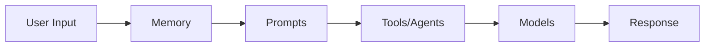
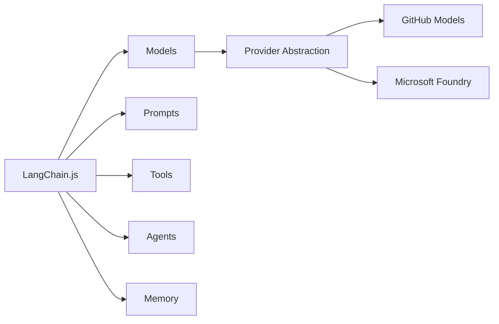

# Introduction to LangChain.js

Welcome to your first step in building AI-powered applications with LangChain.js! In this chapter, you'll learn what LangChain.js is and why it exists, explore its core concepts like models, prompts, and tools, and make your first AI call using GitHub Models. By the end, you'll understand how LangChain.js provides a consistent interface across different AI providers, making it easy to switch between them with just environment variables.

## Prerequisites

- Completed [Course Setup](../00-course-setup/README.md)

## 🎯 Learning Objectives

By the end of this chapter, you'll be able to:

- ✅ Understand what LangChain.js is and why it exists
- ✅ Recognize common AI application patterns
- ✅ Set up a development environment
- ✅ Make your first LLM call using GitHub Models

---

## 📖 Introduction: The Hardware Store Analogy

**Imagine you're building a house.** You could certainly manufacture your own bricks, create cement from scratch, and forge your own tools. Or, you could use a hardware store that provides quality materials and proven tools.

**LangChain.js is the hardware store for AI development.**

Just like a hardware store provides:
- 🔨 **Pre-made tools** (hammers, saws, drills)
- 🧱 **Quality materials** (lumber, nails, paint)
- 📋 **Blueprints** (how-to guides)
- 🔄 **Interchangeable parts** (standard sizes that work together)

LangChain.js provides:
- 🔨 **Pre-built components** (chat models, prompts, tools)
- 🧱 **Quality abstractions** (works with any LLM provider)
- 📋 **Patterns** (common AI application designs)
- 🔄 **Composability** (components that work together seamlessly)

**The result?** You can focus on building your application, not reinventing the wheel.


*LangChain.js is like a hardware store for AI development - providing pre-built components and quality abstractions*

---

## 🧠 What is LangChain.js?

LangChain.js is a **framework for building AI-powered applications** using Large Language Models ([LLMs](../GLOSSARY.md#llm-large-language-model)).

### The Problem It Solves

Without LangChain.js, you'd need to:
- Write different code for each LLM provider (OpenAI, Anthropic, Azure, etc.)
- Build your own prompt management system
- Create custom tools and function calling logic
- Implement memory and conversation handling from scratch
- Build agent systems without any structure

### The LangChain.js Solution

With LangChain.js, you get:

- **[Provider](../GLOSSARY.md#provider) abstraction** - Switch between OpenAI, Azure, Anthropic with minimal code changes
- **Prompt templates** - Reusable, testable prompts
- **Tools** - Extend AI with custom functions and APIs
- **Memory** - Built-in conversation history
- **Agents** - Decision-making AI that can use tools

---

## 🏗️ Core Concepts Overview

LangChain.js is built around 5 core concepts you'll learn throughout this course:

- **[Models](../GLOSSARY.md#model)**: AI "brains" that process inputs and generate outputs. Learn in this chapter.
- **[Prompts](../GLOSSARY.md#prompt)**: How you communicate with AI models using reusable templates. See [Prompts, Messages, and Structured Outputs](../03-prompts-messages-outputs/README.md).
- **[Tools](../GLOSSARY.md#tool)**: Extend AI capabilities with external functions and APIs. Build in [Function Calling & Tools](../04-function-calling-tools/README.md).
- **[Agents](../GLOSSARY.md#agent)**: AI systems that reason and decide which tools to use autonomously. Create in [Getting Started with Agents](../05-agents/README.md).
- **[Memory](../GLOSSARY.md#memory)**: Remember context across interactions. Implement in [Chat Models & Basic Interactions](../02-chat-models/README.md).

---

### How These Concepts Work Together

As you progress through the course, you'll see how these concepts combine:



**Don't worry about understanding everything now!** You'll learn each concept hands-on, building progressively more sophisticated applications. Let's start with your first AI call.

---

## 💻 Hands-On: Your First LLM Call

Let's make your first AI call using LangChain.js and GitHub Models!

### Example 1: Hello World

In this example, you'll create your first LangChain.js program that sends a simple message to an AI model and displays the response.

Let's build this step by step:

**Step 1: Import what we need**

```typescript
import { ChatOpenAI } from "@langchain/openai";
import "dotenv/config";
```

**Step 2: Create the AI model**

```typescript
const model = new ChatOpenAI({
  model: process.env.AI_MODEL,
  configuration: { baseURL: process.env.AI_ENDPOINT },
  apiKey: process.env.AI_API_KEY
});
```

**Step 3: Ask the AI a question**

```typescript
const response = await model.invoke("What is LangChain in one sentence?");
console.log("🤖 AI Response:", response.content);
```

**Code**: [`code/01-hello-world.ts`](./code/01-hello-world.ts)  
**Run**: `tsx 01-introduction/code/01-hello-world.ts`

**Example code**:

```typescript
import { ChatOpenAI } from "@langchain/openai";
import "dotenv/config";

async function main() {
  console.log("🚀 Hello LangChain.js!\n");

  // Create a chat model instance
  const model = new ChatOpenAI({
    model: process.env.AI_MODEL,
    configuration: { baseURL: process.env.AI_ENDPOINT },
    apiKey: process.env.AI_API_KEY
  });

  // Make your first AI call!
  const response = await model.invoke("What is LangChain in one sentence?");

  console.log("🤖 AI Response:", response.content);
  console.log("\n✅ Success! You just made your first LangChain.js call!");
}

main().catch(console.error);
```

> **🤖 Try with [GitHub Copilot](../docs/copilot.md) Chat:** Want to explore this code further? Open this file in your editor and ask Copilot:
> - "What does the invoke() method return and how do I access different properties?"
> - "How does the configuration baseURL work with different AI providers?"

### Expected Output

When you run this example with `tsx 01-introduction/code/01-hello-world.ts`, you'll see:

```
🚀 Hello LangChain.js!

🤖 AI Response: LangChain is a framework for building applications powered by large language models (LLMs).

✅ Success! You just made your first LangChain.js call!
```

### How It Works

**What's happening here?**
1. We import `ChatOpenAI` from the `@langchain/openai` package
2. We create a model instance by instantiating `ChatOpenAI` with configuration
3. We call `invoke()` with a simple string prompt
4. We get back a response with the AI's answer


*The flow of your first LLM call - from creating a model instance to receiving a response*

**Understanding ChatOpenAI Configuration**:

The `ChatOpenAI` constructor takes three key properties: `model` (which AI model), `configuration.baseURL` (API endpoint), and `apiKey` (authentication).

We read these from environment variables (`AI_MODEL`, `AI_ENDPOINT`, `AI_API_KEY`) defined in your `.env` file. This keeps credentials out of code and lets you switch providers by updating `.env`.

**Why use environment variables?**
- `AI_MODEL` specifies which AI model to use (like `gpt-5` or `gpt-5-mini`)
- `AI_ENDPOINT` tells the application where to find the AI service
- `AI_API_KEY` provides authentication credentials

Storing these in `.env` means you can switch between providers (GitHub Models, Azure, OpenAI) by changing just the configuration file, not your code. It's like changing a phone number in your contacts. Same calling process, different destination.

---

## 💬 Understanding Messages

LLMs work best with structured conversations. LangChain.js provides message types that separate system instructions (`SystemMessage`) from user input (`HumanMessage`), giving you precise control over the AI's personality and behavior.

### Example 2: Message Types

Let's see how to use SystemMessage and HumanMessage to control AI behavior and set the tone of responses.

**Code**: [`code/02-message-types.ts`](./code/02-message-types.ts)  
**Run**: `tsx 01-introduction/code/02-message-types.ts`

**Example code:**

```typescript
import { ChatOpenAI } from "@langchain/openai";
import { HumanMessage, SystemMessage } from "langchain";
import "dotenv/config";

async function main() {
  console.log("🎭 Understanding Message Types\n");

  const model = new ChatOpenAI({
    model: process.env.AI_MODEL,
    configuration: { baseURL: process.env.AI_ENDPOINT },
    apiKey: process.env.AI_API_KEY
  });

  // Using structured messages for better control
  const messages = [
    new SystemMessage("You are a helpful AI assistant who explains things simply."),
    new HumanMessage("Explain quantum computing to a 10-year-old."),
  ];

  const response = await model.invoke(messages);

  console.log("🤖 AI Response:\n");
  console.log(response.content);
  console.log("\n✅ Notice how the SystemMessage influenced the response style!");
}

main().catch(console.error);
```

> **🤖 Try with [GitHub Copilot](../docs/copilot.md) Chat:** Want to explore this code further? Open this file in your editor and ask Copilot:
> - "What's the difference between SystemMessage and HumanMessage?"
> - "How would I add an AIMessage to continue this conversation?"

### Expected Output

When you run this example with `tsx 01-introduction/code/02-message-types.ts`, you'll see:

```
🎭 Understanding Message Types

🤖 AI Response: Quantum computing is like having a super-fast magic box that can try many different solutions to a puzzle at the same time! While regular computers look at one answer at a time, quantum computers can explore lots of possibilities all at once, which helps them solve really hard problems much faster.
```

### How It Works

**Message Types**:
- **SystemMessage**: Sets the AI's behavior and personality
- **HumanMessage**: User input
- **AIMessage**: The AI's responses (usually added automatically)

**What's happening**:
1. The SystemMessage tells the AI to explain things simply (like to a beginner)
2. The HumanMessage contains the user's question about quantum computing
3. The AI crafts a response that matches the system instruction (simple explanation)
4. Because we set the personality in the SystemMessage, the response is age-appropriate and clear


*How SystemMessage, HumanMessage, and AIMessage work together in a conversation*

**Why use messages instead of strings?**
- Better control over AI behavior
- Maintains conversation context
- More powerful and flexible

---

## 🔄 Comparing Models

GitHub Models gives you access to multiple AI models. Let's compare them!

**You're building an app and need to choose which model to use.** Should you use `gpt-5` (more capable but costlier) or `gpt-5-mini` (faster and cheaper)?

Think of it like choosing between calculators: a scientific calculator handles complex equations but takes more time and resources, while a basic calculator is fast and efficient for simple math. The best way to decide is to test both with your actual prompts and compare their responses.

### Example 3: Model Comparison

Let's see how to programmatically compare different models side-by-side.

**Code**: [`code/03-model-comparison.ts`](./code/03-model-comparison.ts)  
**Run**: `tsx 01-introduction/code/03-model-comparison.ts`

**Example code:**

```typescript
import { ChatOpenAI } from "@langchain/openai";
import "dotenv/config";

async function compareModels() {
  console.log("🔬 Comparing AI Models\n");

  const prompt = "Explain recursion in programming in one sentence.";
  const models = ["gpt-5", "gpt-5-mini"];

  for (const modelName of models) {
    console.log(`\n📊 Testing: ${modelName}`);
    console.log("─".repeat(50));

    // Override the model for this test
    const model = new ChatOpenAI({
      model: modelName,
      configuration: { baseURL: process.env.AI_ENDPOINT },
      apiKey: process.env.AI_API_KEY,
    });

    const startTime = Date.now();
    const response = await model.invoke(prompt);
    const duration = Date.now() - startTime;

    console.log(`Response: ${response.content}`);
    console.log(`⏱️  Time: ${duration}ms`);
  }

  console.log("\n✅ Comparison complete!");
  console.log("\n💡 Key Observations:");
  console.log("   - gpt-5 is more capable and detailed");
  console.log("   - gpt-5-mini is faster and uses fewer resources");
  console.log("   - Choose based on your needs: speed vs. capability");
}

compareModels().catch(console.error);
```

> **🤖 Try with [GitHub Copilot](../docs/copilot.md) Chat:** Want to explore this code further? Open this file in your editor and ask Copilot:
> - "Why do we create a new ChatOpenAI instance inside the loop?"
> - "How can I add another model to this comparison?"

### Expected Output

When you run this example with `tsx 01-introduction/code/03-model-comparison.ts`, you'll see:

```
🔬 Comparing AI Models


📊 Testing: gpt-5
──────────────────────────────────────────────────
Response: Recursion in programming is a technique where a function calls itself to solve smaller instances of the same problem until it reaches a base case.
⏱️  Time: 2134ms

📊 Testing: gpt-5-mini
──────────────────────────────────────────────────
Response: Recursion is when a function calls itself to solve a problem by breaking it down into smaller, similar sub-problems.
⏱️  Time: 1845ms

✅ Comparison complete!

💡 Key Observations:
   - gpt-5 is more capable and detailed
   - gpt-5-mini is faster and uses fewer resources
   - Choose based on your needs: speed vs. capability
```

> **Note**: Your AI's response may vary slightly from this example, and timing will depend on your network connection and API load. This is normal - LLMs generate different responses each time.

### How It Works

**What's happening**:
1. We define a single prompt asking about recursion
2. We loop through two different models: `gpt-5` and `gpt-5-mini`
3. For each model, we create a new `ChatOpenAI` instance with that model name
4. We invoke the same prompt on each model
5. We display the response from each model for comparison

**What you'll notice**:
- Different models have different response styles
- `gpt-5` tends to be more detailed and sophisticated
- `gpt-5-mini` is more concise but still accurate
- Both answers are correct, just expressed differently
- `gpt-5` is more capable for complex tasks, `gpt-5-mini` is faster and cheaper for simple tasks

---

## 🔄 Switching to Microsoft Foundry

**Want to use Microsoft Foundry instead of GitHub Models?** All the code you just wrote will work with zero changes!

Simply update your `.env` file with your Azure endpoint and API key. For detailed setup instructions, see the [Microsoft Foundry Setup](../00-course-setup/APPENDIX.md#microsoft-foundry-setup).

---

## 🗺️ Concept Map

This chapter introduced you to the core concepts of LangChain.js:



*These concepts work together to create powerful AI applications. You'll explore each in depth throughout the course.*

---

## 🎮 Try This Yourself!

**Quick Challenge**: Before moving to the next section, try modifying Example 1:

1. Open `code/01-hello-world.ts`
2. Change the question from "What is LangChain in one sentence?" to "Explain AI in simple terms"
3. Run it again: `tsx 01-introduction/code/01-hello-world.ts`
4. Notice how the AI adapts to different questions

**Bonus**: Try asking about your favorite programming concept or hobby!

---

## 🌟 Real-World Applications

**Where you'll see these concepts in action:**

- **Chatbots & Virtual Assistants**: Use models, memory, and system messages to maintain helpful conversations
- **Content Generation Tools**: Use prompts and templates to create consistent, high-quality content
- **Code Assistants**: Use tools and agents to search documentation, run tests, and suggest improvements
- **Customer Support Systems**: Use message types to set tone and memory to maintain context across conversations

Now that you understand how these concepts apply to real applications, let's review what you've learned.

---

## 🎓 Key Takeaways

Let's review what you learned:

- **LangChain.js is an abstraction layer** - It provides a consistent interface across different LLM providers
- **Built on composable components** - Models, prompts, tools, agents, and memory work together
- **GitHub Models offers free access** - Perfect for learning and prototyping
- **Microsoft Foundry is production-ready** - Switch anytime by changing the environment variables in your `.env` file
- **Messages have types** - SystemMessage, HumanMessage, and AIMessage serve different purposes

---

## 🏆 Assignment

Ready to practice? Complete the challenges in [assignment.md](./assignment.md)!

The assignment includes:
1. **System Prompts Experiment** - Learn how SystemMessage affects AI behavior
2. **Model Performance Comparison** (Bonus) - Compare multiple models on the same task

---

## 📚 Additional Resources

- [LangChain.js Concepts](https://js.langchain.com/docs/concepts/)
- [GitHub Models Marketplace](https://github.com/marketplace/models)
- [Chat Models Documentation](https://js.langchain.com/docs/integrations/chat/)

**💡 Want more examples?** Check out the [`samples/`](./samples/) folder for additional code examples that demonstrate other useful concepts and patterns!

---

## 🚀 What's Next?

Great work! You've learned the **foundational concepts** of LangChain.js—from what it is and why it exists, to setting up your environment and understanding the key abstractions that power AI applications.

You've laid the foundation in this chapter. Next, you'll start with basic AI conversations, learn to control outputs with prompts and structured data, add tool capabilities, make agents autonomous, connect to external services, add semantic search, and finally combine it all into intelligent RAG systems.

---

## 🗺️ Navigation

[← Previous: Course Setup](../00-course-setup/README.md) | [Back to Main](../README.md) | [Next: Chat Models & Basic Interactions →](../02-chat-models/README.md)

---

## 💬 Questions or stuck?

If you get stuck or have any questions about building AI apps, join:

[](https://aka.ms/foundry/discord)

If you have product feedback or errors while building visit:

[](https://aka.ms/foundry/forum)
