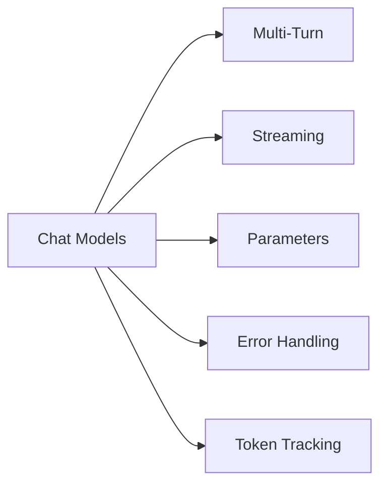

# Chat Models & Basic Interactions

In this chapter, you'll learn the art of having natural conversations with AI models. You'll learn how to maintain conversation context across multiple exchanges, stream responses in real-time for better user experience, and handle errors gracefully with retry logic. You'll also explore key parameters like temperature to control AI creativity and understand token usage for cost optimization.

## Prerequisites

- Completed [Introduction to LangChain.js](../01-introduction/README.md)

## 🎯 Learning Objectives

By the end of this chapter, you'll be able to:

- ✅ Have multi-turn conversations with AI
- ✅ Stream responses for better user experience
- ✅ Handle errors gracefully
- ✅ Control model behavior with parameters
- ✅ Understand token usage

---

## 📖 The Knowledgeable Friend Analogy

**Imagine you're having coffee with a knowledgeable friend.**

When you talk to them:
- 💬 **You have a back-and-forth conversation** (not just one question)
- 🧠 **They remember what you said earlier** (conversation context)
- 🗣️ **They speak as they think** (streaming responses)
- 😊 **They adjust their tone** based on your preferences (model parameters)
- ⚠️ **Sometimes they need clarification** (error handling)

**Chat models work the same way!**

Unlike simple one-off questions, chat models excel at:
- Multi-turn conversations
- Maintaining context
- Streaming responses in real-time
- Adapting their behavior

This chapter teaches you how to have natural, interactive conversations with AI.


*Chat models work like a knowledgeable friend - having back-and-forth conversations with context and adaptability*

---

## 💬 Multi-Turn Conversations

Previously, we sent single messages. But real conversations have multiple exchanges.

### How Conversation History Works

Chat models don't actually "remember" previous messages. Instead, you send the entire conversation history with each new message.

**Think of it like this**: Every time you send a message, you're showing the AI the entire conversation thread so far.


*How the messages array builds up over multiple exchanges - full history sent with each invoke()*

---

### Message Types in LangChain

LangChain provides three core message types for building conversations:

| Type | Purpose | Example |
|------|---------|---------|
| **SystemMessage** | Set AI behavior and personality | `new SystemMessage("You are a helpful coding tutor")` |
| **HumanMessage** | User input and questions | `new HumanMessage("What is TypeScript?")` |
| **AIMessage** | AI responses with metadata | Returned by `model.invoke()` with `content`, `usage_metadata`, `id` |

> **💡 Looking ahead:** In [Prompts, Messages, and Structured Outputs](../03-prompts-messages-outputs/README.md), you'll learn when to use messages vs templates and additional construction patterns for building agents.

---

### Creating Messages

In this course, we use **message classes** to create messages. This approach is explicit and beginner-friendly:

```typescript
import { SystemMessage, HumanMessage, AIMessage } from "langchain";

const messages = [
  new SystemMessage("You are a helpful assistant"),
  new HumanMessage("Hello!")
];
```

**Why message classes?**

- ✅ **Clear and explicit** - Easy to understand what each message represents
- ✅ **Type safety** - TypeScript catches errors before runtime
- ✅ **Better autocomplete** - Your editor helps you write code faster
- ✅ **Consistent pattern** - Same approach used throughout the course

> **💡 Other ways exist:** LangChain also supports dictionary format (`{ role: "system", content: "..." }`) and string shortcuts for simple cases. You'll learn about these alternative syntaxes and when to use each approach in [Prompts, Messages, and Structured Outputs](../03-prompts-messages-outputs/README.md).

---

**You're building a coding tutor chatbot.** When a student asks "What is TypeScript?", then follows up with "Can you show me an example?", the AI needs to remember they're talking about TypeScript. Without conversation history, the AI wouldn't know what "it" or "an example" refers to.

**That's where maintaining message history comes in.** By storing all previous messages (system, human, and AI) in an array and sending the full history with each request, the AI can reference earlier parts of the conversation and provide contextually relevant responses.

### Example 1: Multi-Turn Conversation

Let's see how to maintain conversation context using a `messages` array with `SystemMessage`, `HumanMessage`, and `AIMessage`.

**Key code you'll work with:**

```typescript
// Build the conversation array
const messages: BaseMessage[] = [
  new SystemMessage("You are a helpful coding tutor..."),
  new HumanMessage("What is TypeScript?"),
];

// Get AI response and add it to history
const response1 = await model.invoke(messages);
messages.push(new AIMessage(String(response1.content)));

// Continue the conversation - AI remembers context
messages.push(new HumanMessage("Can you show me a simple example?"));
const response2 = await model.invoke(messages);
```

**Code**: [`code/01-multi-turn.ts`](./code/01-multi-turn.ts)  
**Run**: `tsx 02-chat-models/code/01-multi-turn.ts`

**Example code:**

```typescript
import { ChatOpenAI } from "@langchain/openai";
import { HumanMessage, AIMessage, SystemMessage, type BaseMessage } from "langchain";
import "dotenv/config";

async function main() {
  console.log("💬 Multi-Turn Conversation Example\n");

  const model = new ChatOpenAI({
    model: process.env.AI_MODEL,
    configuration: { baseURL: process.env.AI_ENDPOINT },
    apiKey: process.env.AI_API_KEY,
  });

  // Start with system message and first question
  const messages: BaseMessage[] = [
    new SystemMessage("You are a helpful coding tutor who gives clear, concise explanations."),
    new HumanMessage("What is TypeScript?"),
  ];

  console.log("👤 User: What is TypeScript?");

  // First exchange
  const response1 = await model.invoke(messages);
  console.log("\n🤖 AI:", response1.content);
  messages.push(new AIMessage(String(response1.content)));

  // Second exchange - AI remembers the context
  console.log("\n👤 User: Can you show me a simple example?");
  messages.push(new HumanMessage("Can you show me a simple example?"));

  const response2 = await model.invoke(messages);
  console.log("\n🤖 AI:", response2.content);

  // Third exchange - AI still remembers everything
  console.log("\n👤 User: What are the benefits compared to JavaScript?");
  messages.push(new AIMessage(String(response2.content)));
  messages.push(new HumanMessage("What are the benefits compared to JavaScript?"));

  const response3 = await model.invoke(messages);
  console.log("\n🤖 AI:", response3.content);

  console.log("\n\n✅ Notice how the AI maintains context throughout the conversation!");
  console.log(`📊 Total messages in history: ${messages.length}`);
}

main().catch(console.error);
```

> **🤖 Try with [GitHub Copilot](../docs/copilot.md) Chat:** Want to explore this code further? Open this file in your editor and ask Copilot:
> - "Why do we need to push AIMessage to the messages array after each response?"
> - "How would I implement a loop to keep the conversation going with user input?"

### Expected Output

When you run this example with `tsx 02-chat-models/code/01-multi-turn.ts`, you'll see a three-exchange conversation:

```
💬 Multi-Turn Conversation Example

👤 User: What is TypeScript?

🤖 AI: [Detailed explanation of TypeScript]

👤 User: Can you show me a simple example?

🤖 AI: [TypeScript code example with explanation]

👤 User: What are the benefits compared to JavaScript?

🤖 AI: [Explanation of TypeScript benefits]

✅ Notice how the AI maintains context throughout the conversation!
📊 Total messages in history: 6
```

Notice how each response references the previous context - the AI "remembers" because we send the full message history with each call!

### How It Works

**Key Points**:
1. **Messages array holds the entire conversation** - We create an array that stores all messages (system, human, and AI)
2. **Each response is added to the history** - After getting a response, we push it to the messages array
3. **The AI can reference earlier messages** - When we ask "Can you show me a simple example?", the AI knows we're talking about TypeScript from the first exchange
4. **Full history is sent each time** - With every `invoke()` call, we send the complete conversation history

**Why this matters**: The AI doesn't actually "remember" anything. It only knows what's in the messages array you send. This is why maintaining conversation history is crucial for multi-turn conversations.

---

## ⚡ Streaming Responses

When you ask a complex question, waiting for the entire response can feel slow. [Streaming](../GLOSSARY.md#streaming) sends the response word-by-word as it's generated.

**Like watching a friend think out loud** instead of waiting for them to finish their entire thought.

**You're building a chatbot where users ask complex questions.** With regular responses, users stare at a blank screen for 5-10 seconds wondering if anything is happening. With streaming, they see words appearing immediately—just like ChatGPT—which feels much more responsive even if the total time is the same.


*Non-streaming shows the full response at once after waiting, while streaming displays words progressively for better UX*

### Example 2: Streaming

Let's see how to use `.stream()` instead of `.invoke()` to display responses as they're generated.

**Key code you'll work with:**

```typescript
// Stream the response instead of waiting for it all at once
const stream = await model.stream("Explain how the internet works in 3 paragraphs.");

// Loop through each chunk as it arrives
for await (const chunk of stream) {
  process.stdout.write(chunk.content);  // Display immediately without newline
}
```

**Code**: [`code/02-streaming.ts`](./code/02-streaming.ts)  
**Run**: `tsx 02-chat-models/code/02-streaming.ts`

**Example code:**

```typescript
import { ChatOpenAI } from "@langchain/openai";
import "dotenv/config";

async function main() {
  const model = new ChatOpenAI({
    model: process.env.AI_MODEL,
    configuration: { baseURL: process.env.AI_ENDPOINT },
    apiKey: process.env.AI_API_KEY
  });

  console.log("🤖 AI (streaming): ");

  // Stream the response
  const stream = await model.stream("Explain how the internet works in 3 paragraphs.");

  for await (const chunk of stream) {
    process.stdout.write(chunk.content);
  }

  console.log("\n\n✅ Stream complete!");
}

main().catch(console.error);
```

> **🤖 Try with [GitHub Copilot](../docs/copilot.md) Chat:** Want to explore this code further? Open this file in your editor and ask Copilot:
> - "How does the 'for await...of' loop work with the stream?"
> - "Can I collect all chunks into a single string while streaming?"

### Expected Output

When you run this example with `tsx 02-chat-models/code/02-streaming.ts`, you'll see the response appear word-by-word:

```
🤖 AI (streaming):
The internet is a global network of interconnected computers that communicate using standardized protocols, primarily TCP/IP. When you visit a website, your device sends a request to a server, which responds with the data needed to display the page. This data travels through multiple routers and networks before reaching you.

At its core, the internet works through a system of addresses called IP addresses, which uniquely identify each device. Domain names (like bing.com) are translated to IP addresses by DNS servers. When you type a URL, your browser contacts these DNS servers to find the right destination.

Data on the internet is broken into small packets that travel independently and are reassembled at the destination. This packet-switching method makes the internet resilient and efficient, allowing information to take different routes if one path is blocked or congested.

✅ Stream complete!
```

You'll notice the text appears progressively, word by word, rather than all at once!

### How It Works

**What's happening**:
1. We call `model.stream()` instead of `model.invoke()`
2. This returns an [async iterable](https://developer.mozilla.org/docs/Web/JavaScript/Reference/Iteration_protocols#the_async_iterator_and_async_iterable_protocols) that yields chunks as they're generated
3. We loop through each chunk with `for await...of`
4. Each chunk contains a piece of the response (usually a few words)
5. We use `process.stdout.write()` to display text without newlines, creating the streaming effect

**Benefits of Streaming**:
- Better user experience (immediate feedback)
- Feels more responsive - users see progress immediately
- Users can start reading while AI generates the rest
- Perceived performance improvement even if total time is the same

**When to Use**:

- ✅ Long responses (articles, explanations, code)
- ✅ User-facing chatbots and interactive applications
- ✅ When you want to display progress to users
- ❌ When you need the full response first (parsing, validation, post-processing)

> [!NOTE]
> The actual file [`02-streaming.ts`](./code/02-streaming.ts) includes additional timing measurements and a comparison between streaming and non-streaming approaches to demonstrate the performance benefits. The code above shows the core streaming concept for clarity.

> **💡 Bonus**: To track token usage with streaming, some providers support `streamOptions: { includeUsage: true }` which includes usage metadata in the final chunk. This is provider-dependent - check your provider's documentation for availability.

---

## 🎛️ Model Parameters

You can control how the AI responds by adjusting parameters. These can vary by provider/model so always check the documentation.

### Key Parameters

#### Temperature (0.0 - 2.0)

[Temperature](../GLOSSARY.md#temperature) controls randomness and creativity:

- **0.0 = Deterministic**: Same question → Same answer
  - Use for: Code generation, factual answers
- **1.0 = Balanced** (default): Mix of consistency and variety
  - Use for: General conversation
- **2.0 = Creative**: Some models support up to 2.0 for more random and creative responses but is generally less predictable
  - Use for: Creative writing, brainstorming

> **⚠️ Provider and Model Differences**:
> - **GitHub Models (OpenAI)**: Supports 0.0 to 2.0 for most models
> - **Microsoft Foundry**: Generally limits temperature to 0.0-1.0 depending upon the model
> - **Some models** (like gpt-5-mini): May only support the default temperature value (1) and reject other values
>
> The temperature demo code includes error handling to gracefully skip unsupported values, so you can run it with any model without crashes.

#### Max Tokens

**What are tokens?** [Tokens](../GLOSSARY.md#token) are the basic units of text that AI models process. Think of them as pieces of words - roughly 1 token ≈ 4 characters or ¾ of a word. For example, "Hello world!" is about 3 tokens.

Limits response length:

- Controls how long responses can be
- Setting `maxTokens: 100` limits the response to approximately 75 words
- Prevents runaway costs by capping output length


*Visual representation of how text is broken down into tokens - each piece of the puzzle represents a single token*

**You need to generate creative story openings, but you're not sure what `temperature` value to use.** Should you use 0 (deterministic), 1 (balanced), or 2 (creative)? The best way to understand is to test the same prompt at different temperatures and see how the responses change. Keep in mind that some models may not support all temperature values.

### Example 3: Model Parameters

Let's see how to control creativity by adjusting the `temperature` parameter in `ChatOpenAI`.

**Key code you'll work with:**

```typescript
const temperatures = [0, 1, 2];

for (const temp of temperatures) {
  // Create model with specific temperature
  const model = new ChatOpenAI({
    model: process.env.AI_MODEL,
    temperature: temp,  // Controls randomness/creativity
    // ... other config
  });

  // Try same prompt twice to see variation
  const response = await model.invoke(prompt);
}
```

**Code**: [`code/03-parameters.ts`](./code/03-parameters.ts)  
**Run**: `tsx 02-chat-models/code/03-parameters.ts`

**Example code:**

```typescript
import { ChatOpenAI } from "@langchain/openai";
import "dotenv/config";

async function temperatureComparison() {
  const prompt = "Write a creative opening line for a sci-fi story about time travel.";
  const temperatures = [0, 1, 2];

  for (const temp of temperatures) {
    console.log(`\nTemperature: ${temp}`);
    console.log("-".repeat(80));

    const model = new ChatOpenAI({
      model: process.env.AI_MODEL,
      configuration: { baseURL: process.env.AI_ENDPOINT },
      apiKey: process.env.AI_API_KEY,
      temperature: temp,
    });

    try {
      for (let i = 1; i <= 2; i++) {
        const response = await model.invoke(prompt);
        console.log(`  Try ${i}: ${response.content}`);
      }
    } catch (error: any) {
      // Some models may not support certain temperature values
      if (error.code === "unsupported_value" && error.param === "temperature") {
        console.log(`  ⚠️  This model doesn't support temperature=${temp}. Skipping...`);
        console.log(`  💡 Error: ${error.message}`);
      } else {
        throw error;
      }
    }
  }

  console.log("\n💡 General Temperature Guidelines:");
  console.log("   - Lower values (0-0.3): More deterministic, consistent responses");
  console.log("   - Medium values (0.7-1.0): Balanced creativity and consistency");
  console.log("   - Higher values (1.5-2.0): More creative and varied responses");
}

temperatureComparison().catch(console.error);
```

> **🤖 Try with [GitHub Copilot](../docs/copilot.md) Chat:** Want to explore this code further? Open this file in your editor and ask Copilot:
> - "What temperature value should I use for a customer service chatbot?"
> - "How do I add the maxTokens parameter to limit response length?"

### Expected Output

When you run this example with `tsx 02-chat-models/code/03-parameters.ts`, the output depends on your model:

**With a model that supports all temperature values:**

```
🌡️ Temperature: 0
────────────────────────────────────────────────────────────
"In the year 2157, humanity had finally broken free from the confines of Earth."

🌡️ Temperature: 1
────────────────────────────────────────────────────────────
"The stars whispered secrets through the observation deck's reinforced glass, but Captain Reeves had stopped listening years ago."

🌡️ Temperature: 2
────────────────────────────────────────────────────────────
"Zyx-9 flickered into existence at precisely the wrong moment—right between the temporal rift and Dr. Kwan's morning coffee."
```

**With a model that only supports default temperature (like gpt-5-mini):**

```
Temperature: 0
────────────────────────────────────────────────────────────
  ⚠️  This model doesn't support temperature=0. Skipping...
  💡 Error: 400 Unsupported value: 'temperature' does not support 0 with this model. Only the default (1) value is supported.

Temperature: 1
────────────────────────────────────────────────────────────
  Try 1: On the morning the calendar unstitched itself, I reached into yesterday and came out with a photograph of tomorrow.
  Try 2: The first time I traveled back, I found my future self waiting with tired eyes and a list of instructions on how not to become him.

Temperature: 2
────────────────────────────────────────────────────────────
  ⚠️  This model doesn't support temperature=2. Skipping...
  💡 Error: 400 Unsupported value: 'temperature' does not support 2 with this model. Only the default (1) value is supported.

💡 General Temperature Guidelines:
   - Lower values (0-0.3): More deterministic, consistent responses
   - Medium values (0.7-1.0): Balanced creativity and consistency
   - Higher values (1.5-2.0): More creative and varied responses

⚠️  Note: Model support varies - some models only support specific values
   For example, gpt-5-mini only supports temperature=1 (default)
```

> **⚠️ Model-Specific Behavior**: The error handling allows the script to run successfully regardless of which temperature values your model supports. This demonstrates how real-world AI applications need to handle parameter constraints gracefully.

**Max Tokens Output**:

The script also demonstrates the `maxTokens` parameter, which limits response length:

```
📏 Max Tokens Limit
────────────────────────────────────────────────────────────

Max Tokens: 50
────────────────────────────────────────────────────────────
Machine learning is a subset of artificial intelligence that enables computers to learn from data without being explicitly programmed. It involves algorithms that can identify patterns

(Character count: 187)

Max Tokens: 150
────────────────────────────────────────────────────────────
Machine learning is a subset of artificial intelligence that enables computers to learn from data without being explicitly programmed. It involves algorithms that can identify patterns, make decisions, and improve their performance over time through experience.

There are three main types of machine learning: supervised learning, where models learn from labeled data; unsupervised learning, which finds patterns in unlabeled data; and reinforcement learning, where agents learn through trial and error by receiving rewards or penalties.

(Character count: 512)

Max Tokens: 500
────────────────────────────────────────────────────────────
Machine learning is a subset of artificial intelligence that enables computers to learn from data without being explicitly programmed. It involves algorithms that can identify patterns, make decisions, and improve their performance over time through experience.

There are three main types of machine learning: supervised learning, where models learn from labeled data; unsupervised learning, which finds patterns in unlabeled data; and reinforcement learning, where agents learn through trial and error by receiving rewards or penalties.

[Full 5-paragraph response with complete explanations of applications, neural networks, and future implications]

(Character count: 1500+)

💡 Observations:
   - Lower max tokens = shorter responses
   - Response may be cut off if limit is too low
   - Use max tokens to control costs and response length
```

**Understanding Max Tokens**:
- **Tokens** are pieces of words (roughly 4 characters per token, or ~750 words per 1000 tokens)
- Lower `maxTokens` values result in shorter, potentially truncated responses
- Higher values allow complete responses but increase API costs
- Use `maxTokens` to control response length and manage costs effectively

### How It Works

**Temperature Parameter**:
1. We use the same prompt with three different temperature settings (0, 1, 2)
2. The code wraps each model call in a try-catch to handle unsupported temperature values
3. If a model doesn't support a specific temperature, it displays a warning and continues to the next value
4. Temperature 0 produces the most predictable response (when supported)
5. Temperature 1 (default) balances consistency with creativity
6. Temperature 2 produces more unusual and creative variations

**Max Tokens Parameter**:
1. The script tests three different token limits: 50, 150, and 500
2. Each limit controls how many tokens (word pieces) the AI can use in its response
3. Lower limits (50) often result in incomplete, cut-off responses
4. Medium limits (150) provide partial explanations
5. Higher limits (500) allow for complete, detailed responses
6. The character count shows the relationship between tokens and actual text length

---

## 🛡️ Error Handling with Built-In Retries

API calls can fail due to rate limits, network issues, or temporary service problems. LangChain provides built-in retry logic with exponential backoff.

### Common Errors You'll Encounter

- **429 Too Many Requests**: [Rate limit](../GLOSSARY.md#rate-limit) exceeded (most common for free tiers)
- **401 Unauthorized**: Invalid API key
- **500 Server Error**: Temporary provider issues
- **Network timeout**: Connection problems

### Example 4: Using Built-In Retry Logic

Instead of implementing manual retry logic, use LangChain's `withRetry()` method which handles exponential backoff automatically:

**Key code you'll work with:**

```typescript
const model = new ChatOpenAI({
  model: process.env.AI_MODEL,
  // ... other config
});

// Add automatic retry logic with exponential backoff
const modelWithRetry = model.withRetry({
  stopAfterAttempt: 3,  // Will retry up to 3 times
});

// Use it just like the regular model - retries happen automatically
const response = await modelWithRetry.invoke("What is LangChain.js?");
```

**Code**: [`code/05-error-handling.ts`](./code/05-error-handling.ts)  
**Run**: `tsx 02-chat-models/code/05-error-handling.ts`

**Example code:**

```typescript
import { ChatOpenAI } from "@langchain/openai";
import "dotenv/config";

async function main() {
  const model = new ChatOpenAI({
    model: process.env.AI_MODEL,
    configuration: { baseURL: process.env.AI_ENDPOINT },
    apiKey: process.env.AI_API_KEY,
  });

  // Use built-in retry logic - automatically handles 429 errors
  const modelWithRetry = model.withRetry({
    stopAfterAttempt: 3,  // Max retry attempts
  });

  try {
    console.log("Making API call with automatic retry...\n");
    const response = await modelWithRetry.invoke("What is LangChain.js?");
    console.log("✅ Success!");
    console.log(response.content);
  } catch (error: any) {
    console.error("❌ Error:", error.message);

    // Handle specific error types
    if (error.message.includes("429")) {
      console.log("\n💡 Rate limit hit. Try again in a few moments.");
    } else if (error.message.includes("401")) {
      console.log("\n💡 Check your API key in .env file");
    }
  }
}

main().catch(console.error);
```

> **🤖 Try with [GitHub Copilot](../docs/copilot.md) Chat:** Want to explore this code further? Open this file in your editor and ask Copilot:
> - "How does withRetry() implement exponential backoff?"
> - "Can I customize the retry delay and max attempts with withRetry()?"

### How It Works

**Built-in Retry Benefits**:
- ✅ **Automatic exponential backoff**: Waits longer between each retry (1s, 2s, 4s...)
- ✅ **Works with all LangChain components**: Compatible with agents, RAG, and chains
- ✅ **Handles 429 errors gracefully**: Automatically retries rate limit errors
- ✅ **Less code**: No manual retry loop needed

**What's happening**:
1. `withRetry()` wraps the model with retry logic
2. If a request fails (429, 500, timeout), it automatically retries
3. Exponential backoff increases wait time between retries
4. After max attempts, it throws the error for you to handle

**Why use built-in retries?**
- Simpler code - no manual loops
- Production-tested - handles edge cases
- Works seamlessly when you advance to agents and RAG in later chapters
- Standardized across LangChain ecosystem

> **⚠️ Known Limitation**: `withRetry()` currently has issues with streaming (`.stream()`). Retry logic works correctly with `.invoke()` but may not execute with `.stream()`. For critical operations requiring retry logic, use `.invoke()` instead of `.stream()`.

---

## 📊 Token Tracking and Costs

Tokens power AI models, and they directly impact cost and performance. Let's track them!

### Example 5: Tracking Token Usage

This example shows you how to track token usage for cost estimation and monitoring, helping you optimize your AI application expenses.

**Key code you'll work with:**

```typescript
// Make a request
const response = await model.invoke("Explain what TypeScript is in 2 sentences.");

// Extract token usage from the response metadata
const usage = response.usage_metadata;

console.log(`  Prompt tokens:     ${usage.input_tokens}`);   // Your input
console.log(`  Completion tokens: ${usage.output_tokens}`);  // AI's response
console.log(`  Total tokens:      ${usage.total_tokens}`);   // Total cost basis
```

**Code**: [`code/06-token-tracking.ts`](./code/06-token-tracking.ts)  
**Run**: `tsx 02-chat-models/code/06-token-tracking.ts`

**Example code:**

```typescript
import { ChatOpenAI } from "@langchain/openai";
import "dotenv/config";

async function trackTokenUsage() {
  const model = new ChatOpenAI({
    model: process.env.AI_MODEL,
    configuration: { baseURL: process.env.AI_ENDPOINT },
    apiKey: process.env.AI_API_KEY
  });

  console.log("📊 Token Usage Tracking Example\n");

  // Make a request
  const response = await model.invoke(
    "Explain what TypeScript is in 2 sentences."
  );

  // Extract token usage from metadata (v1 uses usage_metadata)
  const usage = response.usage_metadata;

  if (usage) {
    console.log("Token Breakdown:");
    console.log(`  Prompt tokens:     ${usage.input_tokens}`);
    console.log(`  Completion tokens: ${usage.output_tokens}`);
    console.log(`  Total tokens:      ${usage.total_tokens}`);
  }

  console.log("\n📝 Response:");
  console.log(response.content);
}

trackTokenUsage().catch(console.error);
```

> **🤖 Try with [GitHub Copilot](../docs/copilot.md) Chat:** Want to explore this code further? Open this file in your editor and ask Copilot:
> - "How can I track token usage across multiple API calls in a conversation?"
> - "How would I calculate the cost based on token usage?"

### Expected Output

When you run this example with `tsx 02-chat-models/code/06-token-tracking.ts`, you'll see:

```
📊 Token Usage Tracking Example

Token Breakdown:
  Prompt tokens:     16
  Completion tokens: 216
  Total tokens:      232

📝 Response:
TypeScript is a typed superset of JavaScript that adds optional static types, interfaces,
enums, and modern language features, and is compiled (transpiled) to plain JavaScript that
runs in browsers and Node.js. By enabling compile-time type checking and richer tooling
(auto-complete, refactoring), it helps catch bugs earlier and makes large codebases easier
to read and maintain.
```

### How It Works

**What's happening**:
1. **Make API call**: Send a prompt to the model
2. **Extract metadata**: Get `response.usage_metadata`
3. **Calculate costs**: Multiply tokens by provider rates
4. **Track spending**: Monitor costs per request

**Key insights**:
- **Prompt tokens**: Your input (question + conversation history)
- **Completion tokens**: AI's output (the response)
- **Total tokens**: Sum of both (what you pay for)

**Why track tokens?**
- 💰 **Cost monitoring**: Understand your API spending
- ⚡ **Performance**: More tokens = slower responses
- 📊 **Optimization**: Identify expensive queries
- 🎯 **Budgeting**: Predict costs for production

---

### Cost Optimization Strategies

Two key strategies to reduce costs:

**1. Limit response length with maxTokens**
```typescript
const model = new ChatOpenAI({
  model: process.env.AI_MODEL,
  configuration: { baseURL: process.env.AI_ENDPOINT },
  apiKey: process.env.AI_API_KEY,
  maxTokens: 1000 // Cap the response length
});
```

**2. Trim conversation history**
```typescript
// Keep only recent messages to reduce input tokens
const recentMessages = messages.slice(-10);
const response = await model.invoke(recentMessages);
```

**Why it matters**: Models have [context window](../GLOSSARY.md#context-window) limits (4K-200K+ tokens), more tokens = higher costs and slower responses.

---

## 🗺️ Concept Map

This chapter covered the essential building blocks for creating interactive AI conversations:



*Master these concepts to build robust AI applications.*

---

## 🎓 Key Takeaways

- **Multi-turn conversations**: Send entire message history with each call
- **Streaming**: Display responses as they generate for better UX
- **Temperature**: Controls randomness (0 = consistent, 2 = creative)
- **Error handling**: Always use try-catch and implement retries
- **Token tracking**: Monitor usage and estimate costs for budgeting
- **Cost optimization**: Choose right models, limit responses, cache results
- **Tokens**: Impact cost and limits (1 token ≈ 4 characters)
- **Context window**: Models can only process limited conversation history

---

## 🏆 Assignment

Ready to practice? Complete the challenges in [assignment.md](./assignment.md)!

The assignment includes:
1. **Multi-Turn Chatbot** - Build a conversational bot with history
2. **Temperature Experiment** (Bonus) - Compare creativity at different settings

---

## 📚 Additional Resources

- [Chat Models Documentation](https://js.langchain.com/docs/integrations/chat/)
- [Streaming Guide](https://js.langchain.com/docs/how_to/streaming/)
- [Model Parameters](https://platform.openai.com/docs/api-reference/chat/create)

**💡 Want more examples?** Check out the [`samples/`](./samples/) folder for additional code examples including streaming responses, error handling, and token tracking!

---

## 🚀 What's Next?

Great work! You've learned how to **interact with AI chat models**—from making basic calls to handling conversations with message history. You can now have back-and-forth conversations with AI!

### From Basic Conversations to Controlled Outputs

**You can chat with AI, but how do you control what it says and get reliable, structured responses?** 

Next, you'll learn how to control those conversations with prompts and get structured, reliable outputs that your code can depend on!

---

## 🗺️ Navigation

[← Previous: Introduction to LangChain.js](../01-introduction/README.md) | [Back to Main](../README.md) | [Next: Prompts, Messages, and Structured Outputs →](../03-prompts-messages-outputs/README.md)

---

## 💬 Questions or stuck?

If you get stuck or have any questions about building AI apps, join:

[](https://aka.ms/foundry/discord)

If you have product feedback or errors while building visit:

[](https://aka.ms/foundry/forum)

---

## 📎 Appendix: Provider-Agnostic Initialization

> **💡 Note**: This is a bonus topic. The recommended approach for this course is using `ChatOpenAI` directly, as shown in all the examples above.

### Alternative Pattern: initChatModel()

LangChain.js provides `initChatModel()` for provider-agnostic initialization. Think of it like universal power adapters - instead of different chargers for each device (OpenAI, Anthropic, Google), you have one adapter that works with all of them.

**When `initChatModel()` Shines**:
- 🔄 **Multiple Provider Types**: Switching between OpenAI, Anthropic, Google, etc.
- 🏗️ **Framework Building**: Creating libraries that support many providers
- 🎯 **Provider-Agnostic Code**: Write once, work with any standard provider

**When to Use `ChatOpenAI` (This Course)**:
- ✅ **GitHub Models**: Custom endpoints require specific configuration
- ✅ **Azure OpenAI**: Non-standard API paths work better with ChatOpenAI
- ✅ **Learning**: More explicit and easier to understand
- ✅ **Single Provider**: When you're primarily using one provider

### Example: Provider-Agnostic Patterns

**Code**: [`code/04-init-chat-model.ts`](./code/04-init-chat-model.ts)  

```typescript
import { initChatModel } from "langchain/chat_models/universal";
import { ChatOpenAI } from "@langchain/openai";

// Switching between different provider types (conceptual)
const openaiModel = await initChatModel("gpt-5-mini", {
  modelProvider: "openai",
  apiKey: process.env.OPENAI_API_KEY,
});

const anthropicModel = await initChatModel("claude-3-5-sonnet-20241022", {
  modelProvider: "anthropic",
  apiKey: process.env.ANTHROPIC_API_KEY,
});

// Recommended for this course (GitHub Models/Azure)
const model = new ChatOpenAI({
  model: process.env.AI_MODEL,
  configuration: { baseURL: process.env.AI_ENDPOINT },
  apiKey: process.env.AI_API_KEY
});
```

> **🤖 Try with [GitHub Copilot](../docs/copilot.md) Chat:** Want to explore this code further? Open this file in your editor and ask Copilot:
> - "What are the advantages of initChatModel over using ChatOpenAI directly?"
> - "How would I switch from OpenAI to Anthropic using initChatModel?"

### Comparison

| Feature | `ChatOpenAI` (Recommended) | `initChatModel()` |
|---------|-------------|-------------------|
| **Custom Endpoints** | ✅ Excellent | ⚠️ Limited |
| **Type Safety** | ✅ Excellent | ✅ Good |
| **Learning Curve** | ✅ Easier | 🔄 Moderate |
| **Use Case** | Single provider or custom endpoints | Multiple standard providers |

**For this course**: Stick with `ChatOpenAI`. It's more explicit and works best with GitHub Models and Azure OpenAI.