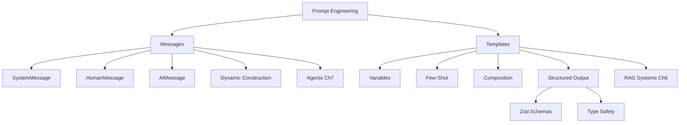

# Prompts, Messages, and Structured Outputs

In this chapter, you'll learn the three essential techniques for working with LLMs in LangChain.js: **messages**, **prompt templates**, and **structured outputs**. Understanding these techniques is key, because modern LangChain.js applications choose different approaches depending on the use case. Messages provide dynamic construction for flexible workflows like agents, templates provide reusable prompts with variable substitution, and structured outputs ensure type-safe data extraction.

This chapter prepares you for both **agents** (using messages) and **RAG systems** (using templates).

## Prerequisites

- Completed [Chat Models & Basic Interactions](../02-chat-models/README.md)

## 🎯 Learning Objectives

By the end of this chapter, you'll be able to:

- ✅ Understand when to use messages vs templates
- ✅ Construct message arrays for agent workflows
- ✅ Create reusable prompt templates for RAG systems
- ✅ Use variables and dynamic content in prompts
- ✅ Implement few-shot prompting (teaching by example)
- ✅ Combine multiple prompts together
- ✅ Generate structured outputs with Zod schemas
- ✅ Choose the right approach for your use case

---

## 🎯 Decision Framework: Messages vs Templates

**Choose the right approach for your use case**:

| Approach | Use For | Chapter |
|----------|---------|---------|
| **Messages** | Agents, dynamic workflows, multi-step reasoning, tool integration | [Getting Started with Agents](../05-agents/README.md) |
| **Templates (classic approach)** | Reusable prompts, variable substitution, consistency, RAG systems, few-shot learning | [Documents, Embeddings & Semantic Search](../07-documents-embeddings-semantic-search/README.md) |

**Both approaches are valuable**: Messages for dynamic workflows, templates for reusability and consistency.


*Choose between messages (for agents and dynamic workflows) or templates (for RAG and reusable prompts)*

---

## PART 1: Message-Based Prompting

Message arrays are the foundation of agent systems in LangChain.js. When you work with agents, you'll use message arrays as input and output.

### 📖 The Conversation Analogy

**Think about a real conversation with context:**

```
System: "You are a helpful coding assistant."
You: "What is a variable?"
AI: "A variable is a container for storing data..."
You: "Can you show me an example?"
AI: "Sure! Here's an example: let name = 'John';"
```

**Each line is a message** with a role (system, human, AI). Message arrays preserve this conversational structure, which is exactly what agents need for multi-step reasoning and tool use.


*Message arrays structure conversations with roles - system sets behavior, human provides input, AI responds*

---

### 📋 Quick Reference: Message Types

Here's a quick reference for the three core message types you'll use throughout this chapter:

| Message Type | Purpose | When to Use | Example |
|--------------|---------|-------------|---------|
| **SystemMessage** | Sets AI's behavior, personality, and role | First message in conversation to establish context | `new SystemMessage("You are a helpful coding assistant.")` |
| **HumanMessage** | Represents user input or questions | Every time the user provides input | `new HumanMessage("What is a variable?")` |
| **AIMessage** | Represents AI's previous responses | Building conversation history or few-shot examples | `new AIMessage("A variable stores data...")` |

**💡 Tip:** SystemMessage is typically used once at the start, while HumanMessage and AIMessage alternate in conversations.

> **Note:** These message types were introduced in [Chat Models & Basic Interactions](../02-chat-models/README.md). If you need a refresher on how they work, review that chapter first.

---

### Example 1: Messages vs Templates - The Big Picture

This foundational example compares both approaches side-by-side and explains when to use each.

**Key code you'll work with:**

```typescript
// APPROACH 1: Messages (used by agents)
const messages = [
  new SystemMessage("You are a helpful translator."),
  new HumanMessage("Translate 'Hello, world!' to French"),
];
const response = await model.invoke(messages);

// APPROACH 2: Templates (used by RAG)
const template = ChatPromptTemplate.fromMessages([
  ["system", "You are a helpful translator."],
  ["human", "Translate '{text}' to {language}"],
]);
const chain = template.pipe(model);
const response = await chain.invoke({ text: "Hello, world!", language: "French" });
```

**Code**: [`code/01-messages-vs-templates.ts`](./code/01-messages-vs-templates.ts)  
**Run**: `tsx 03-prompts-messages-outputs/code/01-messages-vs-templates.ts`

**Example code:**

```typescript
import { ChatOpenAI } from "@langchain/openai";
import { HumanMessage, SystemMessage } from "langchain";
import { ChatPromptTemplate } from "@langchain/core/prompts";
import "dotenv/config";

async function main() {
  const model = new ChatOpenAI({
    model: process.env.AI_MODEL,
    configuration: { baseURL: process.env.AI_ENDPOINT },
    apiKey: process.env.AI_API_KEY,
  });

  // APPROACH 1: Messages
  console.log("APPROACH 1: Message Arrays\n");

  const messages = [
    new SystemMessage("You are a helpful translator."),
    new HumanMessage("Translate 'Hello, world!' to French"),
  ];

  const messageResponse = await model.invoke(messages);
  console.log("Response:", messageResponse.content);

  // APPROACH 2: Templates (classic approach)
  console.log("\nAPPROACH 2: Templates\n");

  const template = ChatPromptTemplate.fromMessages([
    ["system", "You are a helpful translator."],
    ["human", "Translate '{text}' to {language}"],
  ]);

  const templateChain = template.pipe(model);
  const templateResponse = await templateChain.invoke({
    text: "Hello, world!",
    language: "French",
  });

  console.log("Response:", templateResponse.content);
}

main().catch(console.error);
```

> **🤖 Try with [GitHub Copilot](../docs/copilot.md) Chat:** Want to explore this code further? Open this file in your editor and ask Copilot:
> - "When should I use messages vs templates in LangChain.js?"
> - "How do agents use messages differently from RAG systems?"

### Expected Output

When you run this example with `tsx 03-prompts-messages-outputs/code/01-messages-vs-templates.ts`, you'll see both approaches produce the same translation, but they work differently under the hood.

### How It Works

**Message Arrays**:
- Direct construction using `new SystemMessage()` and `new HumanMessage()`
- Passed directly to `model.invoke(messages)`
- No templating or variable substitution
- Used by agents in LangChain

**Templates**:
- Created with `ChatPromptTemplate.fromMessages()`
- Uses variables like `{text}` and `{language}`
- Piped to model: `template.pipe(model)`
- Valuable for reusability and consistency (including RAG systems)

> **💡 Tip**: The actual code file [`01-messages-vs-templates.ts`](./code/01-messages-vs-templates.ts) includes comprehensive explanations of when to use each approach and how they integrate with different LangChain systems. Run the file to see the complete decision framework!

---

### Example 2: Dynamic Message Construction

**Prerequisites:** You should be familiar with SystemMessage, HumanMessage, and AIMessage from [Chat Models & Basic Interactions](../02-chat-models/README.md).

In this example, you'll learn how to build message arrays programmatically and use few-shot prompting with messages - techniques that are essential for building agents.

**Key code you'll work with:**

```typescript
// Function to build messages dynamically
function createConversation(role: string, examples: Array<{question: string; answer: string}>, newQuestion: string): BaseMessage[] {
  const messages: BaseMessage[] = [new SystemMessage(`You are a ${role}.`)];

  // Add few-shot examples
  examples.forEach(({ question, answer }) => {
    messages.push(new HumanMessage(question));
    messages.push(new AIMessage(answer));  // Teach by example
  });

  messages.push(new HumanMessage(newQuestion));
  return messages;
}
```

**Code**: [`code/02-message-construction.ts`](./code/02-message-construction.ts)  
**Run**: `tsx 03-prompts-messages-outputs/code/02-message-construction.ts`

**Example code:**

```typescript
import { ChatOpenAI } from "@langchain/openai";
import {
  HumanMessage,
  SystemMessage,
  AIMessage,
  BaseMessage,
} from "langchain";
import "dotenv/config";

async function main() {
  const model = new ChatOpenAI({
    model: process.env.AI_MODEL,
    configuration: { baseURL: process.env.AI_ENDPOINT },
    apiKey: process.env.AI_API_KEY,
  });

  // PATTERN 3: Dynamic Message Construction
  // Build message arrays programmatically based on runtime data
  function createConversation(
    role: string,
    examples: Array<{ question: string; answer: string }>,
    newQuestion: string,
  ): BaseMessage[] {
    // Start with system message
    const messages: BaseMessage[] = [new SystemMessage(`You are a ${role}.`)];

    // Add examples (few-shot pattern using messages)
    examples.forEach(({ question, answer }) => {
      messages.push(new HumanMessage(question));
      messages.push(new AIMessage(answer));
    });

    // Add the new question
    messages.push(new HumanMessage(newQuestion));

    return messages;
  }

  // Few-Shot Learning with Messages
  // Teach the AI by showing examples in the message history
  const emojiMessages = createConversation(
    "emoji translator",
    [
      { question: "happy", answer: "😊" },
      { question: "sad", answer: "😢" },
      { question: "excited", answer: "🎉" },
    ],
    "surprised",
  );

  console.log("Messages constructed:", emojiMessages.length);
  const response = await model.invoke(emojiMessages);
  console.log("AI Response:", response.content); // Expected: 😮
}

main().catch(console.error);
```

> **🤖 Try with [GitHub Copilot](../docs/copilot.md) Chat:** Want to explore this code further? Open this file in your editor and ask Copilot:
> - "How do I build a multi-turn conversation with message arrays?"
> - "Can I serialize and deserialize message arrays for storage?"

### Expected Output

When you run this example with `tsx 03-prompts-messages-outputs/code/02-message-construction.ts`, you'll see:

```
Messages constructed: 8
AI Response: 😮
```

The function built an 8-message array: 1 system message + 3 examples (6 messages) + 1 new question.

### How It Works

**Pattern 3: Dynamic Message Construction**
- The `createConversation()` function builds message arrays programmatically
- You pass in parameters (`role`, `examples`, `newQuestion`) and it constructs the messages
- Returns a `BaseMessage[]` array that can include any message type
- This pattern is essential for agents that need to construct prompts based on runtime data

**Few-Shot Learning with Messages**
- Instead of using templates, we teach the AI by showing example conversations
- Each example becomes a HumanMessage → AIMessage pair in the array
- The AI learns the pattern from these examples (happy → 😊, sad → 😢, excited → 🎉)
- When we ask about "surprised", the AI follows the learned pattern → 😮

**Why This Matters for Agents**:
- Agents need to construct messages dynamically based on tool results
- Few-shot examples improve agent decision-making and consistency
- Programmatic message building allows loading conversation history from databases
- These patterns prepare you for building agent workflows

**Key Differences from Basic Interactions:**
- Manually creating individual messages for basic conversations
- Building message arrays programmatically with functions
- This approach enables agents to adapt their prompts based on context

### Alternative Message Syntaxes

While we use **message classes** throughout this course for clarity, LangChain also supports alternative syntaxes:

**Dictionary Format** (more concise):
```typescript
const messages = [
  { role: "system", content: "You are helpful" },
  { role: "user", content: "Hello!" },
  { role: "assistant", content: "Hi there!" }
];
```

**String Shortcut** (for simple single messages):
```typescript
// These are equivalent:
const response = await model.invoke("Hello!");
const response = await model.invoke(new HumanMessage("Hello!"));
```

**When to use each:**
- **Message classes** (`new HumanMessage()`): Most explicit and friendly for learning
- **Dictionary format**: More concise, works identically to message classes
- **String shortcut**: Quick for simple single-message calls

> **💡 Note**: All three syntaxes work identically with LangChain. We use message classes in this course because they're explicit and friendly, but you can use whichever syntax you prefer in your own code!

> **💡 Tip**: The actual code file [`02-message-construction.ts`](./code/02-message-construction.ts) includes additional patterns like message metadata and conversation builders. Run the file to see all variations!

---

### 🔗 Looking Ahead

**Everything you've learned about messages prepares you for:**
- [Getting Started with Agents](../05-agents/README.md) - Build agents with message arrays
- Working with Model Context Protocol (MCP) tools
- Creating dynamic workflows that adapt based on context
- Building stateful, multi-step reasoning systems

**Messages are the foundation of modern agent systems in LangChain.js!**

---

## PART 2: Template-Based Prompting

Templates allow you to create reusable, maintainable prompts with variables. This approach is valuable for many use cases including RAG systems, consistent formatting, and any scenario where you need prompt reusability.

### 📖 The Mail Merge Analogy

**Prompt templates work like mail merge.** Instead of writing similar prompts repeatedly, create a template once with placeholders (`{name}`, `{orderId}`), then fill in specifics each time. This ensures consistency and makes updates easier.


*Templates use placeholders {like this} that get replaced with actual values - create once, reuse everywhere*

---

### 🤔 Why Use Prompt Templates?

Templates provide consistency, maintainability, and are used with RAG systems. Create once with `{variables}`, reuse everywhere instead of hardcoding similar prompts.

### Example 3: Basic Templates

Let's see how to create a reusable template using `ChatPromptTemplate.fromMessages()` with template variables.

**Key code you'll work with:**

```typescript
// Create template with variables in curly braces
const template = ChatPromptTemplate.fromMessages([
  ["system", "You are a helpful assistant that translates {input_language} to {output_language}."],
  ["human", "{text}"],
]);

// Pipe to model to create a reusable chain
const chain = template.pipe(model);

// Use the template with different values
const result = await chain.invoke({
  input_language: "English",
  output_language: "French",
  text: "Hello, how are you?"
});
```

**Code**: [`code/03-basic-template.ts`](./code/03-basic-template.ts)  
**Run**: `tsx 03-prompts-messages-outputs/code/03-basic-template.ts`

**Example code:**

```typescript
import { ChatPromptTemplate } from "@langchain/core/prompts";
import { ChatOpenAI } from "@langchain/openai";
import "dotenv/config";

async function main() {
  // Create a reusable template
  const template = ChatPromptTemplate.fromMessages([
    ["system", "You are a helpful assistant that translates {input_language} to {output_language}."],
    ["human", "{text}"],
  ]);

  const model = new ChatOpenAI({
    model: process.env.AI_MODEL,
    configuration: { baseURL: process.env.AI_ENDPOINT },
    apiKey: process.env.AI_API_KEY,
  });

  // Use the template multiple times with different values
  const chain = template.pipe(model);

  const result1 = await chain.invoke({
    input_language: "English",
    output_language: "French",
    text: "Hello, how are you?",
  });

  console.log("French:", result1.content);

  const result2 = await chain.invoke({
    input_language: "English",
    output_language: "Spanish",
    text: "Hello, how are you?",
  });

  console.log("Spanish:", result2.content);
}

main().catch(console.error);
```

> **🤖 Try with [GitHub Copilot](../docs/copilot.md) Chat:** Want to explore this code further? Open this file in your editor and ask Copilot:
> - "How does template.pipe(model) create a chain that can be invoked?"
> - "What happens if I forget to provide one of the template variables?"

### Expected Output

When you run this example with `tsx 03-prompts-messages-outputs/code/03-basic-template.ts`, you'll see:

```
French: Bonjour, comment allez-vous ?
Spanish: Hola, ¿cómo estás?
```

### How It Works

**Key Concepts**:
1. `{variable_name}` creates placeholders in the template
2. `ChatPromptTemplate.fromMessages()` defines the structure with system and human messages
3. `template.pipe(model)` creates a chain that connects the template to the model
4. `invoke()` fills in the variables and sends the complete prompt to the AI

**What's happening**:
- We create ONE template with three variables: `{input_language}`, `{output_language}`, and `{text}`
- We use the template twice with different values (French and Spanish)
- Each time, the variables are replaced with actual values
- The complete prompt is sent to the AI model
- We get translations without having to write separate prompts

**Benefits**: If you want to change how translations work (e.g., add "Be formal" to the system message), you update ONE place and it affects all translations.

> **💡 Tip**: The actual code file [`03-basic-template.ts`](./code/03-basic-template.ts) includes an additional translation example (Japanese) for deeper learning. Run the file to see all variations!

---

### Example 4: Template Formats

This example compares different template formats (ChatPromptTemplate vs PromptTemplate) and shows you when to use each approach.

**Key code you'll work with:**

```typescript
// ChatPromptTemplate: For chat models with system/human messages
const chatTemplate = ChatPromptTemplate.fromMessages([
  ["system", "You are a {role} who speaks in {style} style."],
  ["human", "{question}"],
]);

// PromptTemplate: Simple string-based format
const stringTemplate = PromptTemplate.fromTemplate(
  "Write a {adjective} {item} about {topic}."
);
const prompt = await stringTemplate.format({ adjective: "funny", item: "poem", topic: "JavaScript" });
```

**Code**: [`code/04-template-formats.ts`](./code/04-template-formats.ts)  
**Run**: `tsx 03-prompts-messages-outputs/code/04-template-formats.ts`

**Example code:**

```typescript
import { ChatPromptTemplate, PromptTemplate } from "@langchain/core/prompts";
import { ChatOpenAI } from "@langchain/openai";
import "dotenv/config";

async function main() {
  const model = new ChatOpenAI({
    model: process.env.AI_MODEL,
    configuration: { baseURL: process.env.AI_ENDPOINT },
    apiKey: process.env.AI_API_KEY,
  });

  // Format 1: ChatPromptTemplate (for chat models)
  console.log("1️⃣  ChatPromptTemplate:\n");

  const chatTemplate = ChatPromptTemplate.fromMessages([
    ["system", "You are a {role} who speaks in {style} style."],
    ["human", "{question}"],
  ]);

  const result1 = await chatTemplate.pipe(model).invoke({
    role: "pirate",
    style: "dramatic",
    question: "What is TypeScript?",
  });

  console.log(result1.content);

  // Format 2: PromptTemplate (simpler, string-based)
  console.log("\n2️⃣  PromptTemplate:\n");

  const stringTemplate = PromptTemplate.fromTemplate(
    "Write a {adjective} {item} about {topic}."
  );

  const prompt = await stringTemplate.format({
    adjective: "funny",
    item: "poem",
    topic: "JavaScript",
  });

  console.log("Generated prompt:", prompt);

  const result2 = await model.invoke(prompt);
  console.log("\nResponse:", result2.content);
}

main().catch(console.error);
```

> **🤖 Try with [GitHub Copilot](../docs/copilot.md) Chat:** Want to explore this code further? Open this file in your editor and ask Copilot:
> - "When should I use ChatPromptTemplate vs PromptTemplate?"
> - "How does stringTemplate.format() differ from using pipe and invoke?"

### Expected Output

When you run this example with `tsx 03-prompts-messages-outputs/code/04-template-formats.ts`, you'll see:

```
1️⃣  ChatPromptTemplate:

Arr matey! TypeScript be a mighty tool forged by Microsoft...

2️⃣  PromptTemplate:

Generated prompt: Write a funny poem about JavaScript.

Response:
JavaScript, oh JavaScript,
You're quirky and you're quick...
```

### How It Works

**Two Template Types**:

1. **ChatPromptTemplate** (for conversational AI):
   - Uses message arrays: `["system", "..."], ["human", "..."]`
   - Supports system messages to set AI personality
   - Best for chat models and conversations
   - Pipes directly to the model
   - **Works with RAG systems and many other use cases**

2. **PromptTemplate** (for simple text):
   - Uses plain string templates
   - No system/human message distinction
   - Must call `.format()` to get the filled template
   - Then pass the formatted string to the model

**When to use each**:
- Use `ChatPromptTemplate` when you need system messages, multi-turn conversations, or RAG systems
- Use `PromptTemplate` for simple, single-shot prompts without roles

> **💡 Tip**: The actual code file [`04-template-formats.ts`](./code/04-template-formats.ts) includes a complex multi-variable template example for deeper learning. Run the file to see all variations!

---

### Example 5: Few-Shot Prompting with Templates

Here you'll learn how to teach the AI by example using few-shot prompting to convert emotions to emojis based on provided examples.

**Key code you'll work with:**

```typescript
// Define teaching examples
const examples = [
  { input: "happy", output: "😊" },
  { input: "sad", output: "😢" },
  { input: "excited", output: "🎉" },
];

// Create few-shot template that injects examples
const fewShotTemplate = new FewShotChatMessagePromptTemplate({
  examplePrompt: exampleTemplate,  // How to format each example
  examples: examples,               // The teaching examples
  inputVariables: [],
});
```

**Code**: [`code/05-few-shot.ts`](./code/05-few-shot.ts)  
**Run**: `tsx 03-prompts-messages-outputs/code/05-few-shot.ts`

**Example code:**

[Few-shot prompting](../GLOSSARY.md#few-shot-prompting) means teaching the AI by showing examples.

**Think of it like training a new employee**: Instead of just telling them what to do, you show them examples of good work.


*Few-shot learning: provide examples that teach the pattern, then AI applies it to new inputs*

```typescript
import { ChatPromptTemplate, FewShotChatMessagePromptTemplate } from "@langchain/core/prompts";
import { ChatOpenAI } from "@langchain/openai";
import "dotenv/config";

async function main() {
  const model = new ChatOpenAI({
    model: process.env.AI_MODEL,
    configuration: { baseURL: process.env.AI_ENDPOINT },
    apiKey: process.env.AI_API_KEY,
  });

  // Define examples to teach the model
  const examples = [
    { input: "happy", output: "😊" },
    { input: "sad", output: "😢" },
    { input: "excited", output: "🎉" },
  ];

  // Create example template
  const exampleTemplate = ChatPromptTemplate.fromMessages([
    ["human", "{input}"],
    ["ai", "{output}"],
  ]);

  // Create few-shot template
  const fewShotTemplate = new FewShotChatMessagePromptTemplate({
    examplePrompt: exampleTemplate,
    examples: examples,
    inputVariables: [],
  });

  // Combine with the final question
  const finalTemplate = ChatPromptTemplate.fromMessages([
    ["system", "Convert emotions to emojis based on these examples:"],
    fewShotTemplate,
    ["human", "{input}"],
  ]);

  const chain = finalTemplate.pipe(model);

  // Test with new input
  const result = await chain.invoke({ input: "surprised" });
  console.log("surprised →", result.content);

  const result2 = await chain.invoke({ input: "angry" });
  console.log("angry →", result2.content);
}

main().catch(console.error);
```

> **🤖 Try with [GitHub Copilot](../docs/copilot.md) Chat:** Want to explore this code further? Open this file in your editor and ask Copilot:
> - "How many examples should I provide for effective few-shot prompting?"
> - "Can I dynamically select which examples to include based on the input?"

### Expected Output

When you run this example with `tsx 03-prompts-messages-outputs/code/05-few-shot.ts`, you'll see:

```
surprised → 😮
confused → 😕
tired → 🥱
proud → 🥇
```

### How It Works

**What's happening**:
1. **We provide examples** showing the pattern: "happy" → 😊, "sad" → 😢, "excited" → 🎉
2. **The AI learns the pattern** by seeing these input-output pairs
3. **We ask for new emotions** like "surprised", "confused", "tired", and "proud"
4. **The AI follows the learned pattern** and provides appropriate emojis

**Few-Shot Components**:
- `examples` array: Contains the teaching examples
- `exampleTemplate`: Defines how each example is formatted (human → AI)
- `FewShotChatMessagePromptTemplate`: Injects the examples into the conversation
- Final template: Combines system message + examples + user input

**Benefits of Few-Shot**:
- Teaches the model your desired format without complex instructions
- More reliable than just instructions alone
- Great for structured outputs and consistent formatting
- Reduces need for fine-tuning for many tasks
- **Valuable for many use cases** including RAG systems for response formatting

> **💡 Tip**: The actual code file [`05-few-shot.ts`](./code/05-few-shot.ts) includes an additional code comment generator example demonstrating few-shot learning with different patterns. Run the file to see all variations!

---

**You're building a system that generates personalized educational content.** You have reusable prompt pieces (system role, context, task) that you want to mix and match for different scenarios—beginner vs intermediate, programming vs math, high school vs college. Instead of creating separate templates for every combination, you want to compose them dynamically.

**That's where template composition comes in.** Build a library of reusable prompt components and combine them as needed, like LEGO blocks for prompts.

### Example 6: Template Composition

Let's see how to combine multiple template pieces using string concatenation and `ChatPromptTemplate`.

**Key code you'll work with:**

```typescript
// Create reusable prompt pieces
const systemTemplate = "You are an expert {domain} educator.";
const contextTemplate = "Teaching level: {level}\nAudience: {audience}";
const taskTemplate = "Explain {topic} in simple terms.";

// Compose them together with string concatenation
const fullTemplate = ChatPromptTemplate.fromMessages([
  ["system", systemTemplate + "\n\n" + contextTemplate],  // Combine pieces
  ["human", taskTemplate],
]);
```

**Code**: [`code/06-composition.ts`](./code/06-composition.ts)  
**Run**: `tsx 03-prompts-messages-outputs/code/06-composition.ts`

**Example code:**

```typescript
import { ChatPromptTemplate } from "@langchain/core/prompts";
import { ChatOpenAI } from "@langchain/openai";
import "dotenv/config";

async function main() {
  const model = new ChatOpenAI({
    model: process.env.AI_MODEL,
    configuration: { baseURL: process.env.AI_ENDPOINT },
    apiKey: process.env.AI_API_KEY,
  });

  // Create reusable prompt pieces
  const systemTemplate = "You are an expert {domain} educator.";
  const contextTemplate = "Teaching level: {level}\nAudience: {audience}";
  const taskTemplate = "Explain {topic} in simple terms.";

  // Compose them together
  const fullTemplate = ChatPromptTemplate.fromMessages([
    ["system", systemTemplate + "\n\n" + contextTemplate],
    ["human", taskTemplate],
  ]);

  const chain = fullTemplate.pipe(model);

  // Use for different scenarios
  const result1 = await chain.invoke({
    domain: "programming",
    level: "beginner",
    audience: "high school students",
    topic: "variables",
  });

  console.log("🎓 Beginner explanation:\n");
  console.log(result1.content);

  const result2 = await chain.invoke({
    domain: "programming",
    level: "intermediate",
    audience: "college students",
    topic: "closures",
  });

  console.log("\n\n🎓 Intermediate explanation:\n");
  console.log(result2.content);
}

main().catch(console.error);
```

> **🤖 Try with [GitHub Copilot](../docs/copilot.md) Chat:** Want to explore this code further? Open this file in your editor and ask Copilot:
> - "How does template.partial() work and when would I use it?"
> - "What's the benefit of composing prompts vs using one large template?"

### Expected Output

When you run this example with `tsx 03-prompts-messages-outputs/code/06-composition.ts`, you'll see:

```
🎓 Beginner explanation:

Think of a variable as a labeled box where you can store information...


🎓 Intermediate explanation:

Closures are a fundamental concept where a function retains access to variables from its outer scope...
```

### How It Works

**What's happening**:
1. **We create reusable template pieces**: `systemTemplate`, `contextTemplate`, `taskTemplate`
2. **We combine them with string concatenation**: `systemTemplate + "\n\n" + contextTemplate`
3. **We use the same template for different scenarios**: beginner vs intermediate explanations
4. **Variables customize each piece**: `domain`, `level`, `audience`, `topic`

**Benefits of Composition**:
- **Reusable pieces**: Write common parts once, mix and match
- **Consistency**: Same structure across similar prompts
- **Flexibility**: Different combinations for different needs
- **Maintainability**: Update shared pieces in one place
- **Critical for RAG**: Build document processing templates from reusable components

**Real-world use**: Build a library of prompt components (tone, context, task) and compose them based on user needs or application state.

> **💡 Tip**: The actual code file [`06-composition.ts`](./code/06-composition.ts) includes additional examples demonstrating customer service scenarios and partial templates. Run the file to see all variations!

---

## ✅ Progress Checkpoint

**Congratulations!** You've completed the first two parts of this chapter:

- ✅ **Part 1: Message-Based Prompting** - Building dynamic conversations for agents
- ✅ **Part 2: Template-Based Prompting** - Creating reusable prompts for RAG systems

**What's Next:** Part 3 introduces **Structured Outputs** - transforming AI text responses into type-safe, validated data structures. This is essential for building production applications that need reliable data extraction.

**Taking a break?** This is a natural stopping point. When you return, you'll learn how to get structured JSON instead of free text from AI models.

---

## 📋 Structured Outputs with Zod

So far, we've been getting text responses from AI models. But what if you need **structured data** - like JSON objects with specific fields?


*Transform unstructured text into type-safe, validated JSON using Zod schemas*

### What is Zod?

**[Zod](https://zod.dev/) is a TypeScript-first schema validation library** that defines data structure and rules.

**Quick example**:
```typescript
const PersonSchema = z.object({
  name: z.string().describe("Person's full name"),
  age: z.number().describe("Age in years"),
});
```

With LangChain.js, Zod schemas tell the AI exactly what format to return - ensuring structured, validated data instead of free text.

---

### Why Use Structured Outputs?

Structured outputs provide type safety, validation, and consistency - no need to parse free text responses.
- **Integration**: Easy to use with databases, APIs, etc.
- **Valuable for many scenarios**: Data extraction, RAG systems, API responses, form filling

---

**You're building a system that extracts customer information from support emails.** With free text responses, you'd get messy output like "Name is John, email john@example, he's 25" which requires complex regex parsing and is error-prone. You need reliable, typed data you can store in a database.

**That's where `.withStructuredOutput()` and Zod schemas come in.** Define the exact structure you want (name, age, email) and the AI extracts and formats the data automatically—no manual parsing needed.

### Example 7: Basic Structured Output

Let's see how to use `z.object()` to define a schema and `.withStructuredOutput()` to get typed, validated data.

**Key code you'll work with:**

```typescript
// Define structure with Zod schema
const PersonSchema = z.object({
  name: z.string().describe("The person's full name"),
  age: z.number().describe("The person's age in years"),
  email: z.string().email().describe("The person's email address"),
});

// Create model that returns structured output
// strict: true ensures output exactly matches the schema (recommended)
const structuredModel = model.withStructuredOutput(PersonSchema, {
  strict: true,
});

// Get typed data instead of free text!
const result = await structuredModel.invoke("My name is Alice, I'm 28...");
console.log(result.name);  // Type-safe access
```

**Code**: [`code/07-structured-output.ts`](./code/07-structured-output.ts)  
**Run**: `tsx 03-prompts-messages-outputs/code/07-structured-output.ts`

**Example code:**

```typescript
import { ChatOpenAI } from "@langchain/openai";
import * as z from "zod";
import "dotenv/config";

async function main() {
  console.log("📋 Structured Output Example\n");

  const model = new ChatOpenAI({
    model: process.env.AI_MODEL,
    configuration: { baseURL: process.env.AI_ENDPOINT },
    apiKey: process.env.AI_API_KEY,
  });

  // Define the structure using Zod schema
  const PersonSchema = z.object({
    name: z.string().describe("The person's full name"),
    age: z.number().describe("The person's age in years"),
    email: z.string().email().describe("The person's email address"),
    occupation: z.string().describe("The person's job or profession"),
  });

  // Create a model that returns structured output
  // strict: true ensures the model output exactly matches the schema (recommended)
  const structuredModel = model.withStructuredOutput(PersonSchema, {
    strict: true,
  });

  // Now the AI returns typed data, not just text!
  const result = await structuredModel.invoke(
    "My name is Alice Johnson, I'm 28 years old, work as a software engineer, and you can reach me at alice.j@email.com"
  );

  console.log("✅ Structured Output (typed!):\n");
  console.log(result);
  console.log("\n📝 Accessing fields:");
  console.log(`   Name: ${result.name}`);
  console.log(`   Age: ${result.age}`);
  console.log(`   Email: ${result.email}`);
  console.log(`   Occupation: ${result.occupation}`);
}

main().catch(console.error);
```

> **🤖 Try with [GitHub Copilot](../docs/copilot.md) Chat:** Want to explore this code further? Open this file in your editor and ask Copilot:
> - "How does withStructuredOutput() ensure the response matches the schema?"
> - "Can I make some Zod schema fields optional instead of required?"

### Expected Output

When you run this example with `tsx 03-prompts-messages-outputs/code/07-structured-output.ts`, you'll see:

```
📋 Structured Output Example

✅ Structured Output (typed!):

{
  name: 'Alice Johnson',
  age: 28,
  email: 'alice.j@email.com',
  occupation: 'software engineer'
}

📝 Accessing fields:
   Name: Alice Johnson
   Age: 28
   Email: alice.j@email.com
   Occupation: software engineer
```

### How It Works

**What's happening**:
1. **Define the schema** with Zod: `PersonSchema` specifies exactly what fields we want
2. **Use `.describe()`** to tell the AI what each field represents
3. **Create structured model**: `model.withStructuredOutput(PersonSchema)`
4. **Get typed data**: The AI extracts information and returns it in the exact format we specified
5. **Type-safe access**: TypeScript knows the structure, giving us autocomplete and type checking

**Key Points**:
- `z.object()` defines the structure with field names and types
- `.describe()` tells the AI what each field means (helps extraction accuracy)
- `withStructuredOutput()` ensures the AI returns data in that format
- Result is fully typed in TypeScript - no manual parsing needed!
- Zod validates the data automatically - if the AI returns invalid data, you'll get an error

**Why this is powerful**: No more parsing free text with regex or string splitting. The AI does the extraction and formatting for you!

> **💡 Tip**: The actual code file [`07-structured-output.ts`](./code/07-structured-output.ts) demonstrates the versatility of structured outputs by working with multiple different input formats and edge cases. Run the file to see all variations!

---

### Example 8: Complex Nested Schemas

In this example, you'll extract complex nested company information from text using Zod schemas with arrays, nested objects, and various data types.

**Key code you'll work with:**

```typescript
// Complex schema with nested objects and arrays
const CompanySchema = z.object({
  name: z.string(),
  founded: z.number(),
  headquarters: z.object({          // Nested object
    city: z.string(),
    country: z.string(),
  }),
  products: z.array(z.string()),    // Array of strings
  isPublic: z.boolean(),            // Multiple data types
});

// Create structured model with strict mode for reliable schema compliance
const structuredModel = model.withStructuredOutput(CompanySchema, {
  strict: true,
});

// Combine template with structured output
const chain = template.pipe(structuredModel);
```

**Code**: [`code/08-zod-schemas.ts`](./code/08-zod-schemas.ts)  
**Run**: `tsx 03-prompts-messages-outputs/code/08-zod-schemas.ts`

**Example code:**

```typescript
import { ChatOpenAI } from "@langchain/openai";
import { ChatPromptTemplate } from "@langchain/core/prompts";
import * as z from "zod";
import "dotenv/config";

async function main() {
  console.log("🏢 Complex Structured Output Example\n");

  const model = new ChatOpenAI({
    model: process.env.AI_MODEL,
    configuration: { baseURL: process.env.AI_ENDPOINT },
    apiKey: process.env.AI_API_KEY,
  });

  // Define a complex nested schema
  const CompanySchema = z.object({
    name: z.string().describe("Company name"),
    founded: z.number().describe("Year the company was founded"),
    headquarters: z.object({
      city: z.string(),
      country: z.string(),
    }).describe("Company headquarters location"),
    products: z.array(z.string()).describe("List of main products or services"),
    employeeCount: z.number().describe("Approximate number of employees"),
    isPublic: z.boolean().describe("Whether the company is publicly traded"),
  });

  // Create structured model with strict mode for reliable schema compliance
  const structuredModel = model.withStructuredOutput(CompanySchema, {
    strict: true,
  });

  // Create a prompt template
  const template = ChatPromptTemplate.fromMessages([
    ["system", "Extract company information from the text. If information is not available, make reasonable estimates."],
    ["human", "{text}"],
  ]);

  // Combine template with structured output
  const chain = template.pipe(structuredModel);

  const companyInfo = `
    Microsoft was founded in 1975 and is headquartered in Redmond, Washington.
    The company is publicly traded and has over 220,000 employees worldwide.
    Their main products include Windows, Office, Azure, and Xbox.
  `;

  const result = await chain.invoke({ text: companyInfo });

  console.log("✅ Extracted Company Data:\n");
  console.log(JSON.stringify(result, null, 2));

  console.log("\n📊 Type-safe access:");
  console.log(`   ${result.name} (${result.isPublic ? "Public" : "Private"})`);
  console.log(`   Founded: ${result.founded}`);
  console.log(`   Location: ${result.headquarters.city}, ${result.headquarters.country}`);
  console.log(`   Products: ${result.products.join(", ")}`);
  console.log(`   Employees: ${result.employeeCount.toLocaleString()}`);
}

main().catch(console.error);
```

> **🤖 Try with [GitHub Copilot](../docs/copilot.md) Chat:** Want to explore this code further? Open this file in your editor and ask Copilot:
> - "How do I add validation constraints like min/max to Zod schema fields?"
> - "How would I handle arrays of nested objects in a schema?"

### Expected Output

When you run this example with `tsx 03-prompts-messages-outputs/code/08-zod-schemas.ts`, you'll see:

```
🏢 Complex Structured Output Example

✅ Extracted Company Data:

{
  "name": "Microsoft",
  "founded": 1975,
  "headquarters": {
    "city": "Redmond",
    "country": "United States"
  },
  "products": [
    "Windows",
    "Office",
    "Azure",
    "Xbox"
  ],
  "employeeCount": 220000,
  "isPublic": true
}

📊 Type-safe access:
   Microsoft (Public)
   Founded: 1975
   Location: Redmond, United States
   Products: Windows, Office, Azure, Xbox
   Employees: 220,000
```

### How It Works

**What's happening**:
1. **Complex schema with nested objects**: `headquarters` is an object with `city` and `country`
2. **Arrays**: `products` is an array of strings
3. **Multiple data types**: string, number, boolean, object, array
4. **Template integration**: We use `ChatPromptTemplate` with `withStructuredOutput()`
5. **Smart extraction**: The AI reads unstructured text and extracts data into our schema

**Schema Structure**:
```typescript
CompanySchema = {
  name: string,
  founded: number,
  headquarters: {       // Nested object
    city: string,
    country: string
  },
  products: string[],   // Array
  employeeCount: number,
  isPublic: boolean
}
```

**Real-world applications**:
- Extract contact info from emails into structured database records
- Parse resumes into standardized candidate profiles
- Convert natural language forms into API payloads
- **Build RAG systems** that extract structured data from documents
- Transform unstructured content into structured databases

**When to Use Structured Outputs**:
- 📊 **Data extraction** from text or documents
- 🗂️ **Database inserts** with validated data
- 🔄 **API responses** with guaranteed format
- 🎯 **Form filling** from natural language
- ✅ **Classification tasks** with predefined categories
- **RAG systems** that need structured document metadata

> **💡 Tip**: The actual code file [`08-zod-schemas.ts`](./code/08-zod-schemas.ts) includes additional examples extracting data for SpaceX and Netflix, demonstrating schema flexibility with different data structures. Run the file to see all variations!

---

### 🔗 Looking Ahead

**Everything you've learned about templates and structured outputs prepares you for:**
- [Documents, Embeddings & Semantic Search](../07-documents-embeddings-semantic-search/README.md) - Build RAG systems with templates
- Processing documents with consistent prompts
- Extracting structured metadata from documents
- Creating reusable RAG patterns

**Templates are the foundation of RAG systems in LangChain.js!**

---

## 🗺️ Concept Map

This chapter taught you the TWO approaches to prompt engineering in LangChain.js:



*Choose messages for agents, templates for RAG - both are essential for modern LangChain.js applications.*

---

## 🎓 Key Takeaways

### Messages
- **Direct message construction** - Build conversations programmatically
- **SystemMessage, HumanMessage, AIMessage** - Core message types
- **Multi-turn conversations** - Maintain conversation state
- **Used by agents** - Foundation for agent systems
- **Prepares you for agents** - Foundation for building autonomous agents

### Templates
- **Templates reduce code duplication** - Write once, use everywhere
- **Variables with `{name}` syntax** - Create dynamic prompts
- **ChatPromptTemplate for chat models** - Works with message arrays
- **PromptTemplate for simple cases** - String-based templates
- **Few-shot prompting** - Teach by example for better results
- **Composition** - Combine templates for complex prompts
- **Structured outputs with Zod** - Get typed data, not just text
- **Type safety** - Validate AI responses match your schema
- **Valuable for many use cases** - Reusability, consistency, RAG systems
- **Prepares you for RAG systems** - Foundation for document retrieval and semantic search

### The Big Picture
- **Know when to use each approach** - Messages for agents, templates for RAG
- **Both are essential** - Modern LangChain.js uses both paradigms
- **Maintainability** - Update prompts in one place
- **Type safety** - Leverage TypeScript throughout

---

## 🏆 Assignment

Ready to practice? Complete the challenges in [assignment.md](./assignment.md)!

The assignment includes:
1. **Few-Shot Format Teacher** - Use few-shot prompting to teach the AI a custom output format
2. **Product Data Extractor** (Bonus) - Build a system that extracts product information with structured outputs

---

## 📚 Additional Resources

- [Prompt Templates Documentation](https://js.langchain.com/docs/concepts/prompt_templates)
- [Few-Shot Prompting Guide](https://js.langchain.com/docs/concepts/few_shot_prompting/)
- [Messages Documentation](https://js.langchain.com/docs/concepts/messages)
- [Zod Documentation](https://zod.dev/)

**💡 Want more examples?** Check out the [`samples/`](./samples/) folder for additional code examples including email generation, translation systems, dynamic prompt builders, and template libraries!

---

## 🚀 What's Next?

Great work! You've learned how to **control AI outputs** using prompts, templates, and structured schemas. You can now get predictable, type-safe responses that your application can reliably use!

### From Structured Outputs to Real-World Actions

**You can get structured data from AI, but what if the AI could take actions in the real world?** 

Next, you'll transform those outputs into real-world actions by giving AI tools it can call to turn passive responses into active capabilities!

---

## 🗺️ Navigation

[← Previous: Chat Models & Basic Interactions](../02-chat-models/README.md) | [Back to Main](../README.md) | [Next: Function Calling & Tools →](../04-function-calling-tools/README.md)

---

## 💬 Questions or stuck?

If you get stuck or have any questions about building AI apps, join:

[](https://aka.ms/foundry/discord)

If you have product feedback or errors while building visit:

[](https://aka.ms/foundry/forum)
