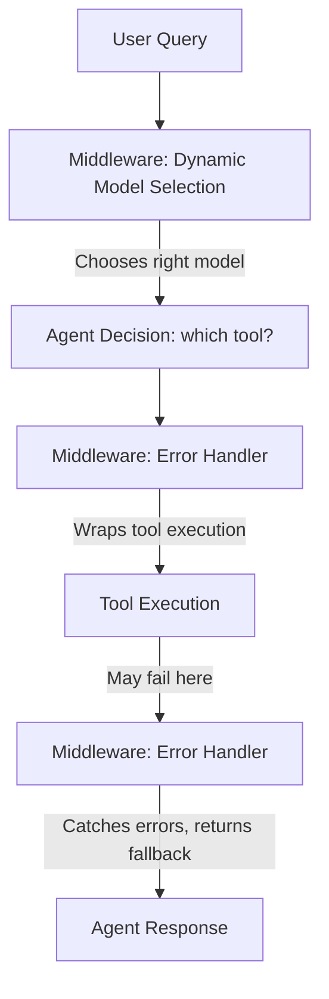
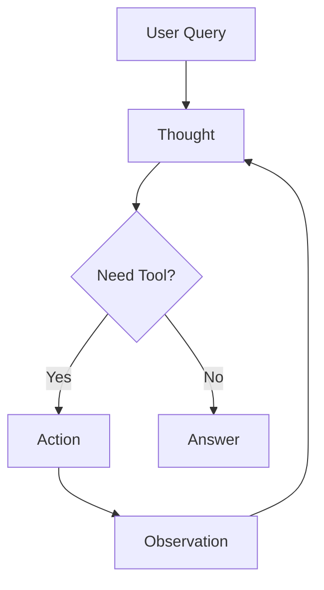

# Getting Started with Agents

In this chapter, you'll learn to build AI [agents](../GLOSSARY.md#agent)—autonomous systems that can reason about problems, dynamically select appropriate tools, and work iteratively towards solutions. You'll master the [ReAct](../GLOSSARY.md#react-pattern) (Reasoning + Acting) pattern, the foundation of modern AI agents, which enables them to think about what needs to be done, act by using tools, observe the results, and repeat this cycle until they accomplish their goal.

**Why agents matter:** In [Function Calling & Tools](../04-function-calling-tools/README.md), you learned to create tools, but you had to manually decide when to call each tool. Agents change this fundamentally—they make autonomous decisions about which tools to use, when to use them, and how many steps are needed to solve a problem. This transforms AI from a single-shot question-answerer into an intelligent system that can break down complex tasks, try different approaches, and work through multi-step problems independently.

You'll discover how to build production-ready agents using LangChain's `createAgent()` API, give agents multiple tools and watch them intelligently select the right one for each query, implement middleware patterns for robust error handling and monitoring, and create autonomous systems that can handle real-world complexity. These skills enable you to build AI applications that go far beyond simple chat—from research assistants that coordinate multiple data sources to task automation systems that can plan and execute complex workflows.

## Prerequisites

- Completed [Function Calling & Tools](../04-function-calling-tools/README.md)

## 🎯 Learning Objectives

By the end of this chapter, you'll be able to:

- ✅ Understand what AI agents are and how they work
- ✅ Implement the ReAct (Reasoning + Acting) pattern
- ✅ Build agent loops that iterate until solving a problem
- ✅ Give agents multiple tools and let them choose the right one
- ✅ Use createAgent() for production-ready agent systems
- ✅ Implement middleware patterns for agent customization
- ✅ Build multi-step, autonomous AI systems

---

## 📖 The Manager with Specialists Analogy

**Imagine you're a project manager with a team of specialists:**

- 📊 Data Analyst - can query databases
- 🔍 Researcher - can search the web
- 🧮 Accountant - can do calculations
- ✉️ Assistant - can send emails

When someone asks: *"What's our revenue growth this quarter compared to last year?"*

You (the manager) don't do everything yourself. You:
1. **Reason**: "I need data from the database and calculations"
2. **Act**: Ask the Data Analyst for revenue data
3. **Observe**: Review the data received
4. **Reason**: "Now I need to calculate the percentage change"
5. **Act**: Ask the Accountant to do the math
6. **Observe**: Get the calculated result
7. **Reason**: "Now I have the answer"
8. **Respond**: Give the final answer

**AI Agents work the same way!**

They:
- **Think** about what needs to be done (Reasoning)
- **Choose** the right tool (Decision Making)
- **Use** the tool (Acting)
- **Evaluate** the result (Observation)
- **Repeat** until they have the answer
- **Respond** to the user


*Both project managers and AI agents delegate tasks to specialists/tools, following the same iterative pattern.*

---

## 🤖 What Are Agents?

### Standard LLM (No Agency or Tools)

```
User: "What's the current weather in Paris?"
LLM: "I cannot access real-time weather data. I can only provide general information..."
```

### Agent with Tools

```
User: "What's the current weather in Paris?"
Agent: [Thinks] "I need to use the weather tool"
Agent: [Uses] getWeather({ city: "Paris" })
Agent: [Observes] "18°C, partly cloudy"
Agent: [Responds] "It's currently 18°C and partly cloudy in Paris"
```


*Agents with tools can access real-time data and take actions, while standard LLMs are limited to their training data.*

---

## 🧠 The ReAct Pattern

ReAct = **Rea**soning + **Act**ing

Agents follow this iterative loop:

```
1. Thought: What should I do next?
2. Action: Use a specific tool
3. Observation: What did the tool return?
4. (Repeat 1-3 as needed)
5. Final Answer: Respond to the user
```

**Example**:
```
User: "Calculate 25 * 17, then tell me if it's a prime number"

Thought 1: I need to calculate 25 * 17
Action 1: calculator({ expression: "25 * 17" })
Observation 1: 425

Thought 2: I need to check if 425 is prime
Action 2: isPrime({ number: 425 })  // Assume we have an isPrime tool
Observation 2: false (divisible by 5)

Final Answer: "25 * 17 equals 425, which is not a prime number
because it's divisible by 5."
```

**Note**: This example assumes you have both `calculator` and `isPrime` tools available. The agent automatically decides which tool to use for each step.


*The ReAct pattern: Agents iteratively reason about what to do, act by using tools, observe results, and repeat until they have the answer.*

---

## 🚀 Building Agents with createAgent()

LangChain.js provides `createAgent()` - a high-level API that handles the ReAct (Reasoning + Acting) loop automatically. This is the **recommended approach** for building production agents.

**What createAgent() does for you**:
- ✅ Manages the ReAct loop (Thought → Action → Observation → Repeat)
- ✅ Handles message history automatically
- ✅ Implements iteration limits to prevent infinite loops
- ✅ Provides production-ready error handling
- ✅ Returns clean, structured responses

Let's build agents using `createAgent()`!

---

**You've built tools that require manual orchestration—you decide when to call them.** What if you want the AI to autonomously decide when to use a tool, try multiple approaches if one fails, and iterate until it solves the problem? That's what agents do! They reason, choose tools, and act independently.

### Example 1: Basic Agent with createAgent()

Let's see how to use `createAgent()` to create an autonomous agent that handles the ReAct loop (Thought → Action → Observation) automatically.

**Key code you'll work with:**
```typescript
// Create agent using v1 createAgent() - that's it!
const agent = createAgent({
  model,
  tools: [calculatorTool],  // Pass tools to the agent
});

// Use the agent with messages array
const response = await agent.invoke({ messages: [new HumanMessage(query)] });

// Get the final answer from the last message
const lastMessage = response.messages[response.messages.length - 1];
```

**Code**: [`code/01-create-agent-basic.ts`](./code/01-create-agent-basic.ts)  
**Run**: `tsx 05-agents/code/01-create-agent-basic.ts`

**Example code:**

```typescript
import { createAgent, HumanMessage, tool } from "langchain";
import { ChatOpenAI } from "@langchain/openai";
import { evaluate } from "mathjs";
import * as z from "zod";
import "dotenv/config";

// Define a calculator tool for the agent
const calculatorTool = tool(
  async (input) => {
    // Use mathjs for safe mathematical evaluation
    const result = evaluate(input.expression);
    return String(result);
  },
  {
    name: "calculator",
    description: "A calculator that can perform basic arithmetic operations.",
    schema: z.object({
      expression: z.string().describe("The mathematical expression to evaluate"),
    }),
  }
);

// Create model
const model = new ChatOpenAI({
  model: process.env.AI_MODEL,
  configuration: { baseURL: process.env.AI_ENDPOINT },
  apiKey: process.env.AI_API_KEY,
});

// Create agent using v1 createAgent() - that's it!
const agent = createAgent({
  model,
  tools: [calculatorTool],
});

// Use the agent with messages array
const query = "What is 125 * 8?";
const response = await agent.invoke({ messages: [new HumanMessage(query)] });

// Get the final answer from the last message
const lastMessage = response.messages[response.messages.length - 1];
console.log(`Agent: ${lastMessage.content}`);
```

> **🤖 Try with [GitHub Copilot](../docs/copilot.md) Chat:** Want to explore this code further? Open this file in your editor and ask Copilot:
> - "What does createAgent() do under the hood?"
> - "How does createAgent() handle iteration limits and prevent infinite loops?"

### Expected Output

When you run `tsx 05-agents/code/01-create-agent-basic.ts`:

```
🤖 Agent with createAgent() Example

👤 User: What is 125 * 8?

🤖 Agent: 125 × 8 = 1000

💡 Key Differences from Manual Loop:
   • createAgent() handles the ReAct loop automatically
   • Less code to write
   • Production-ready error handling built-in
   • Same result, simpler API

✅ Under the hood:
   createAgent() implements the ReAct pattern (Thought → Action → Observation)
   and handles all the boilerplate for you.
```

### How It Works

**What's happening behind the scenes**:
1. **Agent receives query**: "What is 125 * 8?"
2. **Reasons**: Determines it needs the calculator tool
3. **Acts**: Executes `calculator({ expression: "125 * 8" })`
4. **Observes**: Gets result "1000"
5. **Responds**: Formats natural language response

---

**You've built a single-tool agent, but real-world assistants need multiple capabilities.** How do you build an agent that can do math, check weather, and search information—automatically choosing the right tool for each query without manual routing code? Give the agent multiple tools and let it decide.

### Example 2: createAgent() with Multiple Tools

Let's see how to give an agent multiple tools using `tools: [tool1, tool2, tool3]` and observe how it autonomously selects the right one.

**Key code you'll work with:**
```typescript
// Create agent with all three tools - agent auto-selects the right one
const agent = createAgent({
  model,
  tools: [calculatorTool, weatherTool, searchTool],  // Multiple tools!
});

// Agent automatically picks the correct tool for each query
const queries = [
  "What is 50 * 25?",              // → Uses calculator
  "What's the weather in Tokyo?",  // → Uses getWeather
  "Tell me about LangChain.js",    // → Uses search
];
```

**Code**: [`code/02-create-agent-multi-tool.ts`](./code/02-create-agent-multi-tool.ts)  
**Run**: `tsx 05-agents/code/02-create-agent-multi-tool.ts`

**Example code:**

```typescript
import { createAgent, HumanMessage, tool } from "langchain";
import { ChatOpenAI } from "@langchain/openai";
import * as z from "zod";

// Define multiple tools
const calculatorTool = tool(/* ... */);
const weatherTool = tool(/* ... */);
const searchTool = tool(/* ... */);

// Create agent with all three tools
const agent = createAgent({
  model,
  tools: [calculatorTool, weatherTool, searchTool],
});

// Test with different queries - agent selects the right tool automatically
const queries = [
  "What is 50 * 25?",              // → Uses calculator
  "What's the weather in Tokyo?",  // → Uses getWeather
  "Tell me about LangChain.js",   // → Uses search
];

for (const query of queries) {
  const response = await agent.invoke({ messages: [new HumanMessage(query)] });
  const lastMessage = response.messages[response.messages.length - 1];
  console.log(`User: ${query}`);
  console.log(`Agent: ${lastMessage.content}\n`);
}
```

> **🤖 Try with [GitHub Copilot](../docs/copilot.md) Chat:** Want to explore this code further? Open this file in your editor and ask Copilot:
> - "How does the agent decide which tool to use?"
> - "Can I prioritize certain tools over others?"

### Expected Output

When you run `tsx 05-agents/code/02-create-agent-multi-tool.ts`:

```
🎛️  Multi-Tool Agent with createAgent()

👤 User: What is 50 * 25?
🤖 Agent: 50 multiplied by 25 equals 1250.

👤 User: What's the weather in Tokyo?
🤖 Agent: Current weather in Tokyo: 24°C, rainy with occasional thunder

👤 User: Tell me about LangChain.js
🤖 Agent: LangChain.js is a framework for building applications with large
language models (LLMs). It provides tools, agents, chains, and memory systems
to create sophisticated AI applications.

💡 What just happened:
   • The agent automatically selected the right tool for each query
   • Calculator for math (50 * 25)
   • Weather tool for Tokyo weather
   • Search tool for LangChain.js information
   • All with the same agent instance!

✅ Production Pattern:
   This is how you build real-world agents:
   1. Define your tools
   2. Pass them to createAgent()
   3. Let the agent handle tool selection and execution
```

### How It Works

**What's happening**:
1. **Agent receives query**: "What is 50 * 25?"
2. **Reads tool descriptions**: Reviews all available tools
3. **Selects best match**: Calculator tool (description mentions "mathematical calculations")
4. **Executes tool**: Runs calculator with the expression
5. **Returns natural response**: Formats the result in natural language

**Tool Selection Logic**:
- The agent uses tool **names** and **descriptions** to match queries to tools
- More specific descriptions → Better tool selection
- The LLM decides which tool fits best based on semantic meaning
- You can give your agent multiple tools, and it will intelligently pick the right one for each task


*Agents intelligently select the right tool based on semantic matching between the query and tool descriptions.*

---

## 🔧 Additional Agent Patterns

Now that you understand how to build basic agents with single and multiple tools, let's explore an additional pattern for production applications: **middleware**. Middleware lets you add behavior like logging, error handling, and dynamic model selection without modifying your tools or agent core logic.

### Example 3: createAgent() with Middleware

This example shows how to use **middleware** with `createAgent()` for production scenarios like dynamic model selection based on conversation complexity and graceful error handling.

**Key code you'll work with:**
```typescript
// Middleware intercepts agent behavior without changing tools
const dynamicModelSelection = createMiddleware({
  name: "DynamicModelSelection",
  wrapModelCall: (request, handler) => {
    if (request.messages.length > 10) {
      // Switch to more capable model for complex conversations
      return handler({ ...request, model: capableModel });
    }
    return handler(request);
  },
});

// Create agent with middleware - adds behavior like logging & error handling
const agent = createAgent({
  model: basicModel,
  tools: [calculatorTool, searchTool],
  middleware: [dynamicModelSelection, toolErrorHandler],  // Plugin-style behavior!
});
```

**Code**: [`code/03-agent-with-middleware.ts`](./code/03-agent-with-middleware.ts)  
**Run**: `tsx 05-agents/code/03-agent-with-middleware.ts`

**Example code:**

**What is middleware?** Middleware intercepts and modifies agent behavior without changing your tools or agent logic. Think of it as "plugins" for your agent.

```typescript
import { createAgent, createMiddleware } from "langchain";

// Middleware 1: Dynamic Model Selection
// Switches to a more capable (and expensive) model for complex conversations
const dynamicModelSelection = createMiddleware({
  name: "DynamicModelSelection",
  wrapModelCall: (request, handler) => {
    const messageCount = request.messages.length;

    // Option for complex conversations (>10 messages)
    if (messageCount > 10) {
      console.log(`  [Middleware] Switching to more capable model`);
      return handler({
        ...request,
        model: capableModel,
      });
    }

    return handler(request);
  },
});

// Middleware 2: Custom Error Handling
// Catches tool failures and provides helpful fallback messages
const toolErrorHandler = createMiddleware({
  name: "ToolErrorHandler",
  wrapToolCall: async (request, handler) => {
    try {
      return await handler(request);
    } catch (error) {
      console.error(`  [Middleware] Tool "${request.tool}" failed`);
      // Return graceful fallback instead of crashing
      return {
        content: `I encountered an error: ${error.message}. Let me try a different approach.`
      };
    }
  },
});

// Create agent with both middleware
const agent = createAgent({
  model: basicModel,
  tools: [calculatorTool, searchTool],
  middleware: [dynamicModelSelection, toolErrorHandler]
});
```

> **🤖 Try with [GitHub Copilot](../docs/copilot.md) Chat:** Want to explore this code further? Open this file in your editor and ask Copilot:
> - "How would I add request logging middleware?"
> - "Can middleware modify tool arguments before execution?"

### Expected Output

When you run `tsx 05-agents/code/03-agent-with-middleware.ts`:

```
🔧 Agent with Middleware Example

Test 1: Simple calculation
────────────────────────────────────────────────────────────
👤 User: What is 25 * 8?

  [Middleware] Message count: 1
  [Middleware] ✓ Using basic model

🤖 Agent: 25 multiplied by 8 equals 200.


Test 2: Search with error handling
────────────────────────────────────────────────────────────
👤 User: Search for information about error handling

  [Middleware] Message count: 1
  [Middleware] ✓ Using basic model
  [Middleware] ⚠️  Tool "search" failed: Search service temporarily unavailable
  [Middleware] 🔄 Returning fallback message

🤖 Agent: I encountered an error while using the search tool. Let me try
a different approach to answer your question about error handling.

💡 Middleware Benefits:
   • Dynamic model selection → Cost optimization
   • Error handling → Graceful degradation
   • Logging → Easy debugging
   • Flexibility → Customize behavior without changing tools

✅ Production Use Cases:
   • Switch to cheaper models for simple queries
   • Automatic retries with exponential backoff
   • Request/response logging for monitoring
   • User context injection (auth, permissions)
   • Rate limiting and quota management
```

### How It Works

**Middleware Flow**:


**Two Middleware Types**:

1. **wrapModelCall** - Intercepts calls TO the model
   - Dynamic model selection based on conversation length
   - Request logging and monitoring
   - Context injection (user permissions, session data)

2. **wrapToolCall** - Intercepts tool executions
   - Error handling and retries
   - Tool result transformation
   - Permission checks before tool execution

**Production Benefits**:
- ✅ **Cost Optimization**: Use cheap models for simple tasks, expensive for complex
- ✅ **Resilience**: Graceful error handling prevents agent crashes
- ✅ **Observability**: Log all requests for debugging and monitoring
- ✅ **Flexibility**: Add behavior without modifying tools or agent core logic

**When to use middleware**:
- Production agents that need reliability
- Multi-tenant applications (different users, different permissions)
- Cost-sensitive applications
- Systems requiring audit logs

---

## 🗺️ Concept Map

This chapter taught you how agents use the ReAct pattern for autonomous reasoning:



*Agents iterate (Think → Act → Observe) until they solve the problem.*

---

## 🎓 Key Takeaways

- **Agents make autonomous decisions** - They choose which tools to use and when
- **ReAct pattern is the core**: Reason → Act → Observe → Repeat until solved
- **createAgent() is production-ready** - Handles the ReAct loop automatically with built-in error handling
- **Tool descriptions matter** - Clear descriptions help agents pick the right tool
- **Middleware adds flexibility** - Plugin-style behavior for logging, error handling, dynamic model selection
- **Start simple, scale up** - Begin with basic agents, add middleware for production needs

---

## 🏆 Assignment

Ready to practice? Complete the challenges in [assignment.md](./assignment.md)!

The assignment includes:
1. **Research Agent with ReAct Loop** - Build an agent from scratch that uses the ReAct pattern to answer questions
2. **Multi-Step Planning Agent** (Bonus) - Build an agent with multiple specialized tools that requires multi-step reasoning

---

## 📚 Additional Resources

- [LangChain Agents Documentation](https://docs.langchain.com/oss/javascript/langchain/agents)
- [ReAct Paper](https://arxiv.org/abs/2210.03629) - Original research on Reasoning + Acting pattern
- [LangChain createAgent() API](https://docs.langchain.com/oss/javascript/langchain/agents#createagent) - Official API reference

**💡 Want to see manual agent implementations?** Check out the [`samples/`](./samples/) folder for:
- **Manual ReAct loop examples** - See how agents work under the hood without `createAgent()`
- **Step-by-step agent patterns** - Custom loop logic and detailed debugging
- These are great for understanding fundamentals before using `createAgent()`

---

## 🚀 What's Next?

Great work! You've learned how to build **autonomous AI agents** that use the ReAct pattern to reason about problems and decide which tools to use—without hardcoded logic or manual control flow.

### Building on Agents

**Your agents can choose and use tools, but where do those tools come from?** 

Next, you'll connect agents to external services via the Model Context Protocol (MCP), create retrieval tools from documents using embeddings and semantic search, and finally build systems where agents intelligently search your knowledge base in agentic RAG systems.

### Project Ideas (So Far)

With what you've learned, you can build:
- 🧮 **Smart calculator** - Agent that knows when to use math vs search tools
- 🌤️ **Weather assistant** - Agent that coordinates multiple data sources
- 📋 **Task coordinator** - Agent that manages multiple tools for complex workflows
- 🔍 **Research helper** - Agent that combines calculation, search, and analysis tools

After completing the remaining chapters, you'll add external service integration (MCP) and document search capabilities!

---

## 🗺️ Navigation

[← Previous: Function Calling & Tools](../04-function-calling-tools/README.md) | [Back to Main](../README.md) | [Next: Model Context Protocol (MCP) →](../06-mcp/README.md)

---

## 💬 Questions or stuck?

If you get stuck or have any questions about building AI apps, join:

[](https://aka.ms/foundry/discord)

If you have product feedback or errors while building visit:

[](https://aka.ms/foundry/forum)

---

## 🐛 Troubleshooting

Common issues you might encounter when building agents:

### "TypeError: Cannot read property 'tool_calls' of undefined"

**Cause**: The model response doesn't have a `tool_calls` property

**Fix**: Verify that you called `bindTools()` on your model:
```typescript
// ❌ Wrong - forgot to bind tools
const response = await model.invoke(query);

// ✅ Correct - tools are bound
const modelWithTools = model.bindTools([calculatorTool]);
const response = await modelWithTools.invoke(query);
```

### Agent loops forever or hits maxIterations

**Cause**: Agent doesn't have a stopping condition or tools don't return useful results

**Fixes**:
1. Check your stopping condition:
```typescript
if (!response.tool_calls || response.tool_calls.length === 0) {
  // Agent has finished - no more tools needed
  break;
}
```

2. Lower `maxIterations` to fail fast during development:
```typescript
const maxIterations = 3; // Start small, increase if needed
```

3. Ensure tools return meaningful results - vague outputs confuse the agent

### "Tool 'calculator' not found" error

**Cause**: Tool name mismatch between what LLM generates and what you defined

**Fix**: Verify the tool name exactly matches:
```typescript
const calculatorTool = tool(/* ... */, {
  name: "calculator", // Must match exactly
  // ...
});

// LLM will generate:
{ name: "calculator", args: { ... } } // Must match your definition
```

### Agent makes wrong tool choices

**Cause**: Tool descriptions aren't clear enough

**Fix**: Improve tool descriptions with specific use cases:
```typescript
// ❌ Vague
description: "Does calculations"

// ✅ Clear
description: "Perform mathematical calculations like addition, multiplication, percentages. Use this when you need to compute numbers."
```

### "Unexpected token in JSON" when parsing tool arguments

**Cause**: The model generated invalid JSON in tool arguments

**Fix**: Add error handling around tool invocation:
```typescript
try {
  const toolResult = await calculatorTool.invoke(toolCall);
  // ... use result
} catch (error) {
  console.error(`Tool ${toolCall.name} failed:`, error);
  // Add error message to conversation history
  messages.push(
    new ToolMessage({
      content: `Error: ${error.message}`,
      tool_call_id: toolCall.id || ""
    })
  );
}
```

### Agent gets stuck repeating the same tool

**Cause**: Tool doesn't provide enough information for agent to progress

**Fix**: Ensure tool results are descriptive:
```typescript
// ❌ Not helpful
return "42";

// ✅ Descriptive
return "The calculation result is 42. This is the answer to 6 * 7.";
```
