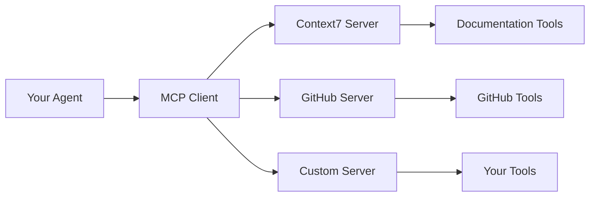

# Model Context Protocol (MCP)

In this chapter, you'll learn how to connect AI agents to external services using the **Model Context Protocol (MCP)**—an open standard that provides a universal interface for AI applications to access tools and data sources. You'll discover how MCP simplifies integration with services like GitHub, databases, and documentation systems, and how to use MCP tools seamlessly with the agents you built in [Getting Started with Agents](../05-agents/README.md).

## Prerequisites

- Completed [Getting Started with Agents](../05-agents/README.md)

## 🎯 Learning Objectives

By the end of this chapter, you'll be able to:

- ✅ Understand what Model Context Protocol (MCP) is and why it matters
- ✅ Connect to external MCP servers using **Streamable HTTP transport**
- ✅ Use **stdio transport** for subprocess communication
- ✅ Integrate MCP tools with LangChain.js agents (same `createAgent()` pattern!)
- ✅ Work with **multiple MCP servers simultaneously** in one agent
- ✅ Implement **robust error handling** (retries, timeouts, fallbacks)
- ✅ Choose the right transport type for your use case
- ✅ Build and deploy **custom MCP servers** to expose your own tools
- ✅ Troubleshoot common MCP connection and integration issues

---

## 📌 About the Code Examples

The code snippets shown in this README are simplified for clarity and focus on core concepts. The actual code files in the `code/`, `solution/`, and `samples/` folders include:

- ✨ **Enhanced console output** with detailed logging and formatting
- 🛡️ **Production-ready error handling** with comprehensive try-catch blocks
- 🔧 **Environment variable support** for flexible configuration
- 💡 **Extended educational comments** explaining MCP concepts

When you run the actual files, you'll see more detailed output than shown in the examples below.

---

## 📖 The USB-C for AI Analogy

**Imagine building a laptop that needs to connect to various peripherals:**

### Before USB-C (Custom Integrations)
- 🔌 Different port for each device (HDMI, DisplayPort, USB-A, Ethernet, power)
- 🔧 Custom drivers and protocols for each
- 📦 Bulky laptop with many specialized ports
- ⏱️ A lot of work to add support for new devices

### With USB-C (MCP Standard)
- ⚡ One universal port for everything
- 🔄 Standardized protocol all devices understand
- ✨ Slim laptop with fewer ports
- ⏰ Quicker to add support for new devices


*MCP provides a standardized way for AI agents to connect to tools - like USB-C for AI applications.*

---

## 🌐 Model Context Protocol (MCP)

**You've built agents with manually created tools, but what about connecting to external services?**

In [Getting Started with Agents](../05-agents/README.md), you created tools (calculator, weather, search) by writing the implementation code yourself. This works great for custom tools specific to your application.

**But what about connecting to existing services or cases where tools need to be used across different AI applications?** Imagine needing tools for:
- GitHub (create issues, search code, manage PRs)
- Calendar (check availability, create events)
- Your company database (query data, get schemas)
- Documentation systems (fetch docs, resolve references)

Writing custom integrations for each service means dealing with different APIs, authentication methods, and data formats. This is where **Model Context Protocol (MCP)** comes in.

### What is MCP?

**Model Context Protocol (MCP)** is an open standard that lets AI applications connect to external tools and data sources through a universal interface. It's like USB-C for AI applications.

**The Problem**: Building an AI assistant that needs to access Calendar details, databases, GitHub, and more means writing custom integrations for each service with different APIs, auth methods, and data formats.

**The MCP Solution**: Services expose their capabilities through a standard protocol. Your agent connects once and gets access to everything.

### Architecture


*MCP provides a standardized way for AI agents to connect to external services - like USB-C for AI applications.*

Each **MCP Server** is a program that exposes tools through the protocol. Your agent connects and can use all available tools.

### Transport Types

MCP defines two standard transport mechanisms for client-server communication:

| Transport | Communication Method | When to Use | Example |
|-----------|---------------------|-------------|---------|
| **Streamable HTTP** | Network-based (client → server over network) | When MCP server is accessed via URL (local or remote) | `{ transport: "http", url: "https://api.mycompany.com/mcp" }` |
| **stdio** | Process-based (parent ↔ child via streams) | When MCP server runs as subprocess of your application | `{ transport: "stdio", command: "node", args: ["/path/to/server.js"] }` |

> **📝 Note on Transport Evolution**: The current MCP specification uses **Streamable HTTP** as the standard network transport. This replaced the older **HTTP+SSE** (Server-Sent Events) transport from an earlier protocol version. In LangChain.js code, you still use `transport: "http"` - the library handles the Streamable HTTP protocol automatically.

**Understanding stdin and stdout**:
- **stdin** (standard input): Where a program reads input - like text from keyboard or piped data
- **stdout** (standard output): Where a program writes output - like text to console or screen
- With stdio transport, the client and server talk to each other through these streams, like two programs connected by a pipe


*Streamable HTTP transport uses network-based communication, while stdio uses process-based communication.*

> **💡 Architecture Choice**: Streamable HTTP is for *network-accessible* servers (think: web service). stdio is for *process-integrated* tools (think: subprocess).

### Why MCP Matters

| Without MCP | With MCP |
|-------------|----------|
| Custom integration per service | One standard protocol |
| Separate auth for each | Unified approach |
| Time intensive to add services | Quicker to add services |

**The key insight**: In [Getting Started with Agents](../05-agents/README.md), you built the tool *implementations*. With MCP, you connect to tool *providers* that expose their capabilities through a standard protocol. Same `createAgent()` pattern, different tool source!

### Using MCP in LangChain.js

LangChain.js provides the `@langchain/mcp-adapters` package for MCP integration:

Now let's see how to connect to an MCP server and use its tools with `createAgent()`.

### Example 1: Agent with MCP Server Integration (Context7)

This example shows how to use `MultiServerMCPClient` to connect to Context7 (a documentation MCP server) and use its tools with `createAgent()`. It's the same agent pattern you've learned, but tools can be accessed and used in a more standardized way.

**Key code you'll work with:**
```typescript
const mcpClient = new MultiServerMCPClient({
  context7: {
    transport: "http",  // Uses Streamable HTTP protocol
    url: "https://mcp.context7.com/mcp"  // Remote MCP server
  }
});

// Get tools from MCP server - that's it!
const tools = await mcpClient.getTools();

// Same createAgent() pattern, different tool source
const agent = createAgent({
  model,
  tools  // Tools from MCP server instead of manually created
});
```

**Code**: [`code/01-mcp-integration.ts`](./code/01-mcp-integration.ts)  
**Run**: `tsx 06-mcp/code/01-mcp-integration.ts`

**Example code:**

**About Context7**: A documentation MCP server that provides current library docs. It offers two tools:
- `resolve-library-id`: Converts library names (e.g., "React") to Context7 IDs
- `get-library-docs`: Retrieves documentation with optional topic filtering

```typescript
import { MultiServerMCPClient } from "@langchain/mcp-adapters";
import { ChatOpenAI } from "@langchain/openai";
import { createAgent, HumanMessage } from "langchain";
import "dotenv/config";

const mcpClient = new MultiServerMCPClient({
  context7: {
    transport: "http",  // Uses Streamable HTTP protocol
    url: "https://mcp.context7.com/mcp"  // Public Context7 endpoint
    // Optional: Add API key for higher rate limits
    // headers: { "Authorization": `Bearer ${process.env.CONTEXT7_API_KEY}` }
  }
});

try {
  // 1. Get all available tools from Context7
  console.log("🔧 Fetching tools from Context7 MCP server...");
  const tools = await mcpClient.getTools();

  console.log(`✅ Retrieved ${tools.length} tools from Context7:`);
  tools.forEach(tool => {
    console.log(`   • ${tool.name}: ${tool.description}`);
  });

  // 2. Create model
  const model = new ChatOpenAI({
    model: process.env.AI_MODEL,
    configuration: { baseURL: process.env.AI_ENDPOINT },
    apiKey: process.env.AI_API_KEY
  });

  // 3. Create agent with MCP tools - same createAgent() pattern from Getting Started with Agents!
  const agent = createAgent({
    model,
    tools  // Tools from MCP server - that's the only difference!
  });

  // 4. Use the agent to get documentation
  const query = "How do I use React useState hook? Get the latest documentation.";
  console.log(`👤 User: ${query}\n`);

  const response = await agent.invoke({ messages: [new HumanMessage(query)] });
  const lastMessage = response.messages[response.messages.length - 1];

  console.log(`🤖 Agent: ${lastMessage.content}\n`);

  console.log("💡 Key Concepts:");
  console.log("   • MCP provides standardized access to external tools");
  console.log("   • MultiServerMCPClient connects to one or more MCP servers");
  console.log("   • Streamable HTTP transport works with remote servers like Context7");
  console.log("   • Tools from MCP servers work seamlessly with createAgent()");
  console.log("   • Same createAgent() pattern, different tool source!");
  console.log("   • No manual loop needed - createAgent() handles the ReAct pattern");

} catch (error) {
  console.error("❌ Error connecting to Context7 MCP server:", error);
} finally {
  // Close the MCP client connection to allow the script to exit
  await mcpClient.close();
  console.log("\n✅ MCP client connection closed");
}
```

> **💡 Simplification Note**: The actual code file uses `process.env.MCP_SERVER_URL || "https://mcp.context7.com/mcp"` with environment variable support. The snippet above is simplified to show the core concept. See the full file for production patterns.

> **🤖 Try with [GitHub Copilot](../docs/copilot.md) Chat:** Want to explore this code further? Open this file in your editor and ask Copilot:
> - "How does MultiServerMCPClient differ from manually creating tools?"
> - "Can I connect to multiple MCP servers simultaneously?"

**Expected Output**:
```
🔧 Fetching tools from Context7 MCP server...
✅ Retrieved 2 tools from Context7:
   • resolve-library-id: Convert library names to Context7 IDs
   • get-library-docs: Retrieve library documentation

👤 User: How do I use React useState hook? Get the latest documentation.

🤖 Agent: The `useState` hook is React's primary way to add state to functional components...

💡 Key Concepts:
   • MCP provides standardized access to external tools
   • Same createAgent() pattern, different tool source!

✅ MCP client connection closed
```

---

### Example 2: MCP with stdio Transport

This example shows how to use **stdio transport** to run an MCP server as a subprocess. Unlike HTTP (which communicates over network), stdio uses standard input/output streams for communication.

**Key code you'll work with:**
```typescript
// Run MCP server as a local subprocess
const mcpClient = new MultiServerMCPClient({
  localCalculator: {
    transport: "stdio",  // Local subprocess, not HTTP!
    command: "npx",
    args: ["tsx", join(__dirname, "servers/stdio-calculator-server.ts")]
  }
});

// Same agent pattern, different transport type
const tools = await mcpClient.getTools();
const agent = createAgent({ model, tools });
```

**Server (start this first)**: [`code/servers/stdio-calculator-server.ts`](./code/servers/stdio-calculator-server.ts)  
**Code**: [`code/02-mcp-stdio-local.ts`](./code/02-mcp-stdio-local.ts)  
**Run**: `tsx 06-mcp/code/02-mcp-stdio-local.ts`


**Transport Comparison**:

| Feature | Streamable HTTP (Example 1) | stdio (Example 2) |
|---------|-----------------|-------------------|
| **Communication** | Network-based (HTTP requests) | Process-based (stdin/stdout streams) |
| **Server Deployment** | Runs independent of client | Runs as subprocess of client |
| **Connection** | Client connects via URL | Client spawns and manages process |
| **Lifecycle** | Server runs independently | Server lifecycle tied to client |
| **Best For** | Network-accessible services (local or remote) | Process-integrated tools (tight coupling) |

**Both transports can**:
- ✅ Authenticate users (Streamable HTTP: tokens/keys, stdio: subprocess credentials)
- ✅ Access network resources (Streamable HTTP: directly, stdio: subprocess can make network calls)
- ✅ Be used in production (choice depends on architecture and needs)

> **💡 The Real Difference**:
> - **Streamable HTTP**: MCP server is a separate web service that clients connect to
> - **stdio**: MCP server is a subprocess accessed directly by the client
>
> Think: Streamable HTTP = calling a web API, stdio = running a program and talking to it.

**Expected Output**:
```
📟 Connecting to stdio MCP server...
✅ Connected! Retrieved 2 tools from local server:
   • calculate: Perform mathematical calculations using mathjs
   • convert_temperature: Convert temperature between Celsius and Fahrenheit

🧮 Testing calculator tool...

👤 User: What is 15 * 23 + 100?
🤖 Agent: 15 * 23 + 100 = 445

🌡️  Testing temperature conversion...

👤 User: Convert 100 degrees Fahrenheit to Celsius
🤖 Agent: 100°F = 37.78°C

💡 Key Concepts:
   • stdio transport runs MCP server as a subprocess
   • Communicates via standard input/output streams

✅ MCP client connection closed
```

---

### Example 3: Multi-Server Agent Integration

This example demonstrates the real power of MCP: connecting to **multiple MCP servers simultaneously**. The agent gets tools from all servers and intelligently chooses which to use based on the query!

**Key code you'll work with:**
```typescript
// Connect to multiple servers at once!
const mcpClient = new MultiServerMCPClient({
  context7: {
    transport: "http",
    url: "https://mcp.context7.com/mcp"  // Remote docs server
  },
  calculator: {
    transport: "stdio",
    command: "npx",
    args: ["tsx", join(__dirname, "servers/stdio-calculator-server.ts")]  // Local math server
  }
});

// Agent gets tools from BOTH servers
const tools = await mcpClient.getTools();  // Combines tools from all servers
const agent = createAgent({ model, tools });

// Agent chooses the right tool for each task automatically!
```


*One AI Agent connecting to multiple MCP servers simultaneously - Context7 for documentation, Calculator for math, GitHub for code, and Filesystem for file operations.*

**Code**: [`code/03-mcp-multi-server.ts`](./code/03-mcp-multi-server.ts)  
**Run**: `tsx 06-mcp/code/03-mcp-multi-server.ts`


**What makes this powerful:**
- ✅ Mix different transport types (Streamable HTTP + stdio)
- ✅ Combine tools from different services
- ✅ Agent automatically routes queries to appropriate tools
- ✅ Scale to dozens of servers without changing agent code
- ✅ Real-world example: GitHub + Calendar + Database + Documentation in one agent

**Real-World Use Cases:**
- Documentation (Context7) + Math (Calculator) + Weather (API)
- GitHub (code) + Calendar (scheduling) + Database (data queries)
- Internal company tools + External services in unified interface

**Expected Output**:
```
🌐 Connecting to multiple MCP servers...

🔧 Fetching tools from all servers...
✅ Retrieved 4 total tools from 2 servers:

📚 From Context7 (Documentation):
   • resolve-library-id: Convert library names to Context7 IDs
   • get-library-docs: Retrieve library documentation

🧮 From Local Calculator:
   • calculate: Perform mathematical calculations
   • convert_temperature: Convert temperature between units

Test 1: Math question (should use calculator)

👤 User: What is 25 * 4 + 100?
🤖 Agent: 25 * 4 + 100 = 200

Test 2: Documentation question (should use Context7)

👤 User: What is React? Get documentation.
🤖 Agent: React is a JavaScript library for building user interfaces...

💡 Key Concepts:
   • Agent receives tools from ALL connected servers
   • Agent automatically chooses the right tool for each task

✅ All MCP connections closed
```

---

### Example 4: Error Handling & Production Patterns

This example shows **best practices** for handling MCP failures, using LangChain's built-in retry capabilities.

**Key code you'll work with:**
```typescript
// Use LangChain's built-in retry logic - no custom code needed!
const baseModel = new ChatOpenAI({
  model: process.env.AI_MODEL,
  configuration: { baseURL: process.env.AI_ENDPOINT },
  apiKey: process.env.AI_API_KEY
});

// Automatic retry with exponential backoff
const modelWithRetry = baseModel.withRetry({
  stopAfterAttempt: 3  // Max 3 retry attempts
});

const agent = createAgent({
  model: modelWithRetry,  // Use model with retry
  tools
});

// Execute with timeout
const timeoutMs = 30000;
const response = await Promise.race([
  agent.invoke({ messages: [new HumanMessage(query)] }),
  new Promise((_, reject) =>
    setTimeout(() => reject(new Error("Query timeout")), timeoutMs)
  )
]);
```

**Code**: [`code/04-mcp-error-handling.ts`](./code/04-mcp-error-handling.ts)  
**Run**: `tsx 06-mcp/code/04-mcp-error-handling.ts`

**Patterns covered:**
1. **LangChain's withRetry()** - Built-in exponential backoff (no custom code!)
2. **Connection health checks** - Monitor MCP server availability
3. **Timeout handling** - Prevent indefinite hangs
4. **Graceful degradation** - Continue operating when MCP is down
5. **Fallback strategies** - Use alternative servers or cached data
6. **Proper cleanup** - Always close connections in finally blocks

**Why use withRetry()?**
- ✅ No custom retry loops needed
- ✅ Production-tested exponential backoff
- ✅ Works with all LangChain components
- ✅ Simpler code, fewer bugs

**Production Checklist:**
- ✅ Use model.withRetry() for automatic retries
- ✅ Request timeouts
- ✅ Fallback strategies
- ✅ Health monitoring
- ✅ Error logging/metrics
- ✅ Graceful degradation

**Expected Output**:
```
🛡️  MCP Error Handling & Retry Patterns

Pattern 1: Primary + Fallback Strategy

📡 Trying primary server (Context7)...
🔄 Attempting to connect to MCP server...
✅ Connected! Retrieved 2 tools

🔧 Fetching tools from MCP server...
✅ Retrieved 2 tools successfully

Pattern 2: Using LangChain's Built-In withRetry()

✅ Model configured with automatic retry (max 3 attempts)
   - LangChain handles exponential backoff automatically
   - No custom retry loops needed!

Pattern 3: Query Execution with Timeout

👤 User: What is React? Get the latest documentation.
🤖 Agent: React is a JavaScript library...

Pattern 4: MCP Server Health Check

✅ MCP server is healthy

🏥 Health status: HEALTHY

💡 Error Handling Best Practices:
   ✅ Use LangChain's withRetry() for automatic exponential backoff
   ✅ Implement fallback servers for high availability

✅ MCP connection closed gracefully
```

---

### How It Works

**What's Different from Getting Started with Agents**:
1. **Tool Source**: Instead of creating tools manually, you get them from an MCP server
2. **Tool Discovery**: `mcpClient.getTools()` fetches all available tools from the server
3. **Tool Execution**: The MCP client handles communication with the remote server
4. **Same createAgent() Pattern**: The agent works identically - only the tool source changed!

**Benefits of MCP Integration**:
- ✅ **No custom integration code** - MCP handles the connection
- ✅ **Dynamic tool discovery** - Server can add/remove tools without code changes
- ✅ **Standard protocol** - Works with any MCP-compliant server
- ✅ **Production-ready** - Streamable HTTP transport scales for remote deployments

**Setting Up Context7**:

The example works out of the box with the public Context7 server - no configuration needed! The code automatically connects to `https://mcp.context7.com/mcp`.

**Optional customization**:
- To use a local Context7 server instead, set `MCP_SERVER_URL=http://localhost:3000/mcp` in your `.env` file, then run:
  ```bash
  npx -y @upstash/context7-mcp --transport http --port 3000
  ```
- For higher rate limits with the public server, get an API key at [context7.com](https://context7.com) and uncomment the `headers` section in the code

---

### Example 5: Creating Custom MCP Servers

Want to build your own MCP server to expose custom tools? This example shows how to create a production-ready HTTP MCP server that any MCP client can connect to!

**Why create custom servers?**
- Expose your company's internal tools to AI agents
- Wrap existing APIs in MCP standard
- Create reusable tools for your team
- Share your tools with the MCP community

**Key code you'll work with:**
```typescript
import { Server } from "@modelcontextprotocol/sdk/server/index.js";
import { StreamableHTTPServerTransport } from "@modelcontextprotocol/sdk/server/streamableHttp.js";
import { ListToolsRequestSchema, CallToolRequestSchema } from "@modelcontextprotocol/sdk/types.js";

// 1. Create MCP server with tools capability
const mcpServer = new Server(
  { name: "my-calculator", version: "1.0.0" },
  { capabilities: { tools: {} } }
);

// 2. Define available tools
mcpServer.setRequestHandler(ListToolsRequestSchema, async () => ({
  tools: [
    {
      name: "calculate",
      description: "Perform mathematical calculations",
      inputSchema: {
        type: "object",
        properties: {
          expression: { type: "string", description: "Math expression to evaluate" }
        },
        required: ["expression"]
      }
    }
  ]
}));

// 3. Handle tool execution
mcpServer.setRequestHandler(CallToolRequestSchema, async (request) => {
  if (request.params.name === "calculate") {
    const { expression } = request.params.arguments;
    const result = evaluate(expression);  // Using mathjs
    return { content: [{ type: "text", text: String(result) }] };
  }
  throw new Error(`Unknown tool: ${request.params.name}`);
});

// 4. Set up HTTP server with Express and connect transport
// Full implementation includes session management, error handling, cleanup
```

**Complete Implementation**:
[`samples/basic-mcp-server.ts`](./samples/basic-mcp-server.ts) - A production-ready calculator MCP server (226 lines) with:
- Session management for multiple clients
- Error handling and logging
- Graceful shutdown
- Connection cleanup

**Run the server**:
```bash
tsx 06-mcp/samples/basic-mcp-server.ts
# Server starts on http://localhost:3000/mcp
```

**Connect to your custom server**:
```typescript
const mcpClient = new MultiServerMCPClient({
  myCalculator: {
    transport: "http",
    url: "http://localhost:3000/mcp"
  }
});
```

**Server Components**:
1. **MCP Server** - Defines tools and handles requests
2. **Transport Layer** - StreamableHTTPServerTransport for HTTP
3. **Session Management** - Tracks multiple client connections
4. **Express Server** - Handles HTTP endpoints (GET, POST, DELETE)
5. **Error Handling** - Proper error responses and logging

**Best Practices**:
- ✅ Use descriptive tool names and descriptions
- ✅ Validate input parameters with JSON schemas
- ✅ Handle errors gracefully and return helpful messages
- ✅ Implement session cleanup to prevent memory leaks
- ✅ Add logging for debugging and monitoring
- ✅ Support graceful shutdown (SIGINT handling)

**Learn More**:

- [MCP SDK Documentation](https://modelcontextprotocol.io/docs) - Official SDK reference
- [MCP Registry](https://github.com/mcp) - MCP server implementations

---

## 🗺️ Concept Map

This chapter taught you how MCP standardizes AI tool integration:



*One client, multiple servers, standardized protocol - that's the power of MCP.*

---

## 🎓 Key Takeaways

- **MCP is a universal standard** - Like USB-C for AI applications, one protocol for all services
- **Two transport types serve different needs**:
  - **Streamable HTTP**: Network-based communication, works with local or remote servers
  - **stdio**: Process-based communication via standard input/output streams
- **Works seamlessly with agents** - Same `createAgent()` pattern you've already learned about, just a different tool source
- **Multi-server power** - Connect to dozens of servers, agent intelligently chooses right tools
- **Production patterns matter** - Always implement error handling, retries, timeouts, and fallbacks
- **Dynamic tool discovery** - Servers can add/remove tools without client code changes
- **Create your own servers** - Expose company tools, wrap APIs, share with MCP ecosystem
- **Troubleshooting is key** - Know how to debug connection issues, transport problems, and tool failures

---

## 🏆 Assignment

Ready to practice? Complete the challenges in [assignment.md](./assignment.md)!

The assignment includes:
1. **Connect to MCP Server** - Set up Context7 integration
2. **Build Multi-Server Agent** - Connect to multiple MCP servers
3. **Custom Tool Integration** (Bonus) - Combine MCP tools with manual tools

---

## 📚 Additional Resources

- [MCP for Beginners](https://github.com/microsoft/mcp-for-beginners) - Complete course on MCP
- [Model Context Protocol](https://modelcontextprotocol.io/) - Official MCP specification and documentation
- [LangChain MCP Adapters](https://www.npmjs.com/package/@langchain/mcp-adapters) - LangChain.js MCP integration package
- [MCP Registry](https://github.com/mcp) - Explore available MCP servers
- [Context7 MCP Server](https://github.com/upstash/context7) - Documentation server used in this chapter

---

## 🐛 Troubleshooting

Common issues you might encounter when working with MCP:

### "Failed to connect to MCP server" or Connection Timeout

**Cause**: MCP server is not running, unreachable, or behind a firewall

**Fixes**:

1. **For Streamable HTTP transport**: Verify the URL is correct and server is running:
```typescript
// Test the endpoint manually first
const url = "https://mcp.context7.com/mcp";
console.log(`Testing connection to ${url}...`);
```

2. **For stdio transport**: Check that the server file path is correct:
```typescript
// Use absolute path or verify relative path
const serverPath = join(__dirname, "servers/stdio-calculator-server.ts");
console.log(`Server path: ${serverPath}`);
// Ensure file exists before connecting
```

3. **Add connection timeout and retry logic** (see Example 4):
```typescript
// Implement retry with exponential backoff
await retryWithBackoff(() => mcpClient.getTools(), 3, 1000);
```

### "No tools returned from MCP server"

**Cause**: Server is running but not exposing any tools, or authorization failed

**Fixes**:

1. **Check server logs** for errors in tool registration
2. **Verify authentication** if server requires API keys:
```typescript
const mcpClient = new MultiServerMCPClient({
  context7: {
    transport: "http",
    url: "https://mcp.context7.com/mcp",
    headers: {
      "Authorization": `Bearer ${process.env.CONTEXT7_API_KEY}` // Add auth header
    }
  }
});
```

3. **Test server directly** using a simple MCP client to isolate the issue

### "Module not found" for stdio server

**Cause**: Server file path is incorrect or server dependencies not installed

**Fixes**:

1. **Verify path resolution**:
```typescript
import { fileURLToPath } from "url";
import { dirname, join } from "path";

const __filename = fileURLToPath(import.meta.url);
const __dirname = dirname(__filename);
const serverPath = join(__dirname, "servers/stdio-calculator-server.ts");
```

2. **Check that server file exists**:
```bash
# Verify server file exists
ls 06-mcp/code/servers/stdio-calculator-server.ts

# Note: stdio servers run via transport, not manually.
# They communicate via stdin/stdout pipes.
```

3. **Ensure all server dependencies are installed** in your project

### Agent doesn't use MCP tools

**Cause**: Tools not properly passed to agent, or tool descriptions unclear

**Fixes**:

1. **Verify tools are retrieved and passed to agent**:
```typescript
const tools = await mcpClient.getTools();
console.log(`Retrieved ${tools.length} tools:`, tools.map(t => t.name));

const agent = createAgent({
  model,
  tools  // Ensure tools array is passed here
});
```

2. **Check tool descriptions are clear** - vague descriptions confuse the agent:
```typescript
// Tools should have clear, specific descriptions
// MCP server should expose well-described tools
```

3. **Test with explicit tool request** in your query:
```typescript
const query = "Use the calculate tool to compute 5 * 10";
// Being explicit helps verify tools are accessible
```

### "Session terminated" or "Transport closed" errors

**Cause**: MCP connection was closed unexpectedly or timeout occurred

**Fixes**:

1. **Implement proper cleanup** with try/finally:
```typescript
const mcpClient = new MultiServerMCPClient(config);
try {
  // Use MCP client
} finally {
  await mcpClient.close();  // Always close
}
```

2. **Handle connection failures gracefully** (see Example 4 for retry patterns)

3. **For stdio transport**: Ensure subprocess doesn't crash:
```bash
# Check server logs for errors
# Servers log to stderr with stdio transport
```

### Multiple MCP servers conflict or tools have same name

**Cause**: Different servers exposing tools with identical names

**Fixes**:

1. **MCP automatically namespaces tools** by server, but if conflicts occur:
```typescript
// Check which server provides which tool
tools.forEach(tool => {
  console.log(`Tool: ${tool.name}, Description: ${tool.description}`);
});
```

2. **Rely on tool descriptions** - agent uses descriptions to choose the right tool

3. **Consider renaming tools** in your MCP server implementation if conflicts are problematic

### Performance issues with stdio transport

**Cause**: Subprocess startup overhead or communication latency

**Fixes**:

1. **Choose transport based on architecture needs**:
```typescript
// If MCP server needs to be network-accessible (shared across processes/machines):
const http = { transport: "http", url: "https://api.myserver.com/mcp" };

// If MCP server is tightly integrated with client process:
const stdio = { transport: "stdio", command: "npx", args: ["tsx", "server.ts"] };
```

2. **Consider keeping server process alive** for repeated calls (advanced)

3. **Cache tool lists** if they don't change between calls

---

## 🚀 What's Next?

Great work! You've learned how to connect AI agents to external services using the **Model Context Protocol (MCP)**—a standardized way to integrate tools without writing custom implementations for each service.

### Building on MCP

**Your agents can now use tools from external services, but what about searching through your own documents and knowledge bases?** In the next chapters, you'll learn:

1. **Documents, Embeddings & Semantic Search** - Process documents, create embeddings, and build semantic search capabilities
2. **Building Agentic RAG Systems** - Combine agents with document retrieval to build intelligent question-answering systems

---

## 🗺️ Navigation

[← Previous: Getting Started with Agents](../05-agents/README.md) | [Back to Main](../README.md) | [Next: Documents, Embeddings & Semantic Search →](../07-documents-embeddings-semantic-search/README.md)

---

## 💬 Questions or stuck?

If you get stuck or have any questions about building AI apps, join:

[](https://aka.ms/foundry/discord)

If you have product feedback or errors while building visit:

[](https://aka.ms/foundry/forum)
