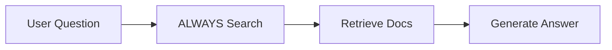
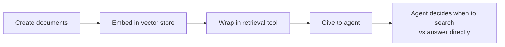
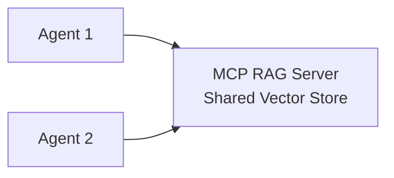
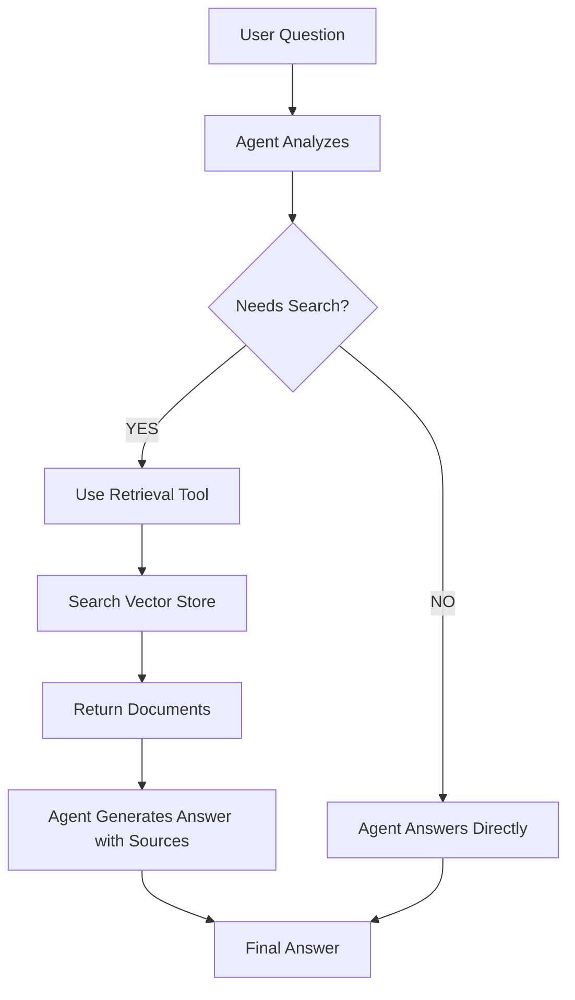

# Building Agentic RAG Systems

In this chapter, you'll learn to build **Agentic RAG** systems where AI agents intelligently decide when and how to search your documents to answer questions. Unlike traditional RAG that always searches regardless of need, agentic RAG gives your AI the autonomy to determine whether retrieval is necessary—answering directly when it has the knowledge, or searching your documents when additional context is needed.

You'll combine everything you've learned to build intelligent question-answering systems that provide accurate, sourced answers from custom knowledge bases. You'll continue using:

- Tools from [Function Calling & Tools](../04-function-calling-tools/README.md)
- Agents from [Getting Started with Agents](../05-agents/README.md)
- Document retrieval from [Documents, Embeddings & Semantic Search](../07-documents-embeddings-semantic-search/README.md)

## Prerequisites

- Completed [Function Calling & Tools](../04-function-calling-tools/README.md)
- Completed [Getting Started with Agents](../05-agents/README.md)
- Completed [Documents, Embeddings & Semantic Search](../07-documents-embeddings-semantic-search/README.md)

## 🎯 Learning Objectives

By the end of this chapter, you'll be able to:

- ✅ Understand the difference between Agentic RAG and Traditional RAG
- ✅ Build agents that decide when to search vs answer directly
- ✅ Create retrieval tools from vector stores
- ✅ Implement intelligent document search with agent decision-making
- ✅ Handle context and citations in agentic systems
- ✅ Apply the decision framework (RAG vs Prompt Engineering)

---

## 📖 The Smart Student Analogy

**Imagine three types of students taking an exam:**

**Closed-Book Exam (Standard LLM)**:
- ❌ Student relies only on memorized knowledge
- ❌ Can't look up specific facts
- ❌ May give wrong answers confidently
- ❌ Knowledge cutoff (stops learning at training time)

**Open-Book Exam with No Strategy (Traditional RAG)**:
- ✅ Student can reference textbook during exam
- ❌ Looks up the textbook for EVERY question, even "What is 2+2?"
- ❌ Wastes time searching when they already know the answer
- ✅ More accurate, can cite sources
- ❌ Slower and more expensive due to unnecessary searches

**Smart Open-Book Exam (Agentic RAG)**:
- ✅ Student can reference textbook during exam
- ✅ **Decides** when to look things up vs answering from knowledge
- ✅ "What is 2+2?" → Answers directly (no search needed)
- ✅ "What was our company's Q3 revenue?" → Searches documents
- ✅ Fast for simple questions, thorough for complex ones
- ✅ More accurate, can cite sources when needed

**This is the power of Agentic RAG!** The agent makes intelligent decisions about when retrieval is necessary.


*The Smart Student analogy: Closed-book relies only on memory, Traditional RAG searches everything, Agentic RAG intelligently decides when to search.*

---

## 🤖 Agentic RAG vs Traditional RAG

### The Key Difference

**Traditional RAG**:

Every question triggers a search, even if the agent already knows the answer.

**Agentic RAG**:

The agent uses reasoning to determine whether retrieval is necessary.


*Traditional RAG always searches, while Agentic RAG makes intelligent decisions about when searching is necessary.*

### Example: The Difference in Action

**"What is 2 + 2?"**
- Traditional RAG: Searches vector store, retrieves irrelevant docs, answers "4" (wasted search)
- Agentic RAG: Answers immediately "4" (no search needed)

**"What was our company's revenue in Q3 2024?"**
- Traditional RAG: Searches vector store, retrieves financial docs, answers "$1.2M"
- Agentic RAG: Searches documents, answers "$1.2M based on Q3 financial report"

### Benefits of Agentic RAG

| Benefit | Traditional RAG | Agentic RAG |
|---------|-----------------|-------------|
| **Efficiency** | Searches every time | Only searches when needed |
| **Speed** | Slow for simple questions | Fast for simple, thorough for complex |
| **Cost** | Embedding + search cost on every query | Lower cost - searches only when necessary |
| **Intelligence** | Rigid, predictable | Adaptive, makes decisions |
| **Complexity** | Simple pipeline | Requires agent loop |

### When to Use Each Approach

**Use Traditional RAG when**:
- Every question requires searching your documents
- Example: "Search our legal database for cases about X"
- You want predictable, simple behavior

**Use Agentic RAG when**:
- Questions mix general knowledge and custom data
- Example: "What is the capital of France and what's our Paris office address?"
  - Agent answers capital from general knowledge (Paris)
  - Agent searches documents for office address
- You want optimal performance and cost

**For most applications, Agentic RAG is the better choice** because it combines flexibility with efficiency.

---

## 🏗️ Agentic RAG Architecture


*Agentic RAG Architecture: The agent decides whether to retrieve documents or answer directly, then generates a response with citations when needed.*

**Key Components**:
1. **Agent**: Makes decisions about when to search
2. **Retrieval Tool**: Searches the vector store when needed
3. **Vector Store**: Contains your document embeddings
4. **Intelligent Decision**: Agent decides search vs direct answer

### When to Use RAG vs Prompt Engineering

**Decision tree:**
1. Fits easily in prompt? → **Prompt Engineering**
2. Large knowledge base that doesn't fit? → **RAG**
3. Updates frequently? → **RAG**
4. Need source citations? → **RAG**


*Decision tree for choosing between Prompt Engineering (small, static data) and RAG (large, dynamic knowledge base with citations).*

**Prompt Engineering**: Small data, static content (e.g., FAQ bot with 20 questions). Simple, fast, no infrastructure.

**RAG**: Large knowledge base, frequent updates, need citations (e.g., customer support with 10,000 manuals). Scalable, up-to-date, provides source attribution.

---

## 💻 Building Your First RAG System

Before we build a RAG system, let's make sure RAG is the right choice! Let's see the decision framework in action.

### Example 1: Choosing the Right Approach (RAG vs Alternatives)

This example demonstrates the decision framework we just learned, comparing Prompt Engineering and RAG side by side to understand when each approach makes sense.

**Key code you'll work with:**
```typescript
// Wrap vector store in a retrieval tool for the agent
const retrievalTool = tool(
  async (input) => {
    const results = await vectorStore.similaritySearch(input.query, 2);  // Search for top 2 matches
    return results.map((doc, i) => `[${doc.metadata.source}]: ${doc.pageContent}`).join("\n\n");
  },
  {
    name: "searchDocs",
    description: "Search company documentation for technical information...",  // Agent reads this to decide when to call
    schema: z.object({ query: z.string().describe("The search query") })
  }
);

// Create agent with the retrieval tool - agent decides when to use it
const agent = createAgent({ model, tools: [retrievalTool] });
```

**Code**: [`code/01-when-to-use-rag.ts`](./code/01-when-to-use-rag.ts)  
**Run**: `tsx 08-agentic-rag-systems/code/01-when-to-use-rag.ts`  

**Example code:**

This demo shows two real-world scenarios:

1. **Scenario 1: Small FAQ Bot** → Uses **Prompt Engineering** (5 Q&As fit in prompt)
2. **Scenario 2: Large Documentation Bot** → Uses **Agentic RAG** (1000s of docs, agent decides when to search)

```typescript
import { ChatOpenAI } from "@langchain/openai";
import { OpenAIEmbeddings } from "@langchain/openai";
import { MemoryVectorStore } from "@langchain/classic/vectorstores/memory";
import { Document } from "@langchain/core/documents";
import { ChatPromptTemplate } from "@langchain/core/prompts";
import { createAgent, HumanMessage, tool } from "langchain";
import * as z from "zod";
import "dotenv/config";

async function main() {
  console.log("🎯 When to Use RAG: Decision Framework Demo\n");
  console.log("=".repeat(80) + "\n");

  const model = new ChatOpenAI({
    model: process.env.AI_MODEL,
    configuration: { baseURL: process.env.AI_ENDPOINT },
    apiKey: process.env.AI_API_KEY
  });

  // Scenario 1: Small FAQ (Prompt Engineering)
  console.log("📋 SCENARIO 1: Small FAQ Bot");
  console.log("─".repeat(80));
  console.log("\nProblem: Answer 5 common questions about a product");
  console.log("Data size: 5 questions/answers (fits easily in prompt)");
  console.log("Update frequency: Rarely changes");
  console.log("\n✅ BEST APPROACH: Prompt Engineering\n");

  const faqContext = `
Product FAQ:
Q: What is the return policy?
A: 30-day money-back guarantee, no questions asked.

Q: How long is shipping?
A: 2-3 business days for standard, 1 day for express.

Q: Is there a warranty?
A: Yes, 1-year manufacturer warranty on all products.

Q: Do you ship internationally?
A: Yes, we ship to over 100 countries worldwide.

Q: What payment methods do you accept?
A: We accept all major credit cards, PayPal, and Apple Pay.
`;

  const faqPrompt = ChatPromptTemplate.fromMessages([
    ["system", "You are a helpful customer service assistant. Answer questions based on this FAQ:\n\n{context}"],
    ["human", "{question}"],
  ]);

  const faqChain = faqPrompt.pipe(model);

  const faqQuestion = "What's your return policy?";
  console.log(`Question: "${faqQuestion}"\n`);

  const faqResponse = await faqChain.invoke({
    context: faqContext,
    question: faqQuestion,
  });

  console.log("Answer:", faqResponse.content);

  console.log("\n💡 Why Prompt Engineering works here:");
  console.log("   • Small dataset (5 Q&As) fits easily in prompt");
  console.log("   • No search needed - all context is relevant");
  console.log("   • Simple to maintain - just update the string");
  console.log("   • Fast and cost-effective");

  console.log("\n" + "=".repeat(80) + "\n");

  // Scenario 2: Large Knowledge Base (Agentic RAG)
  console.log("📚 SCENARIO 2: Company Documentation Bot");
  console.log("─".repeat(80));
  console.log("\nProblem: Answer questions from 1,000+ documentation pages");
  console.log("Data size: Too large to fit in prompt (exceeds context window)");
  console.log("Update frequency: Documentation changes frequently");
  console.log("\n✅ BEST APPROACH: Agentic RAG (Agent + Retrieval Tool)\n");

  // Simulate a large knowledge base
  const docs = [
    new Document({
      pageContent: "The API authentication uses OAuth 2.0 with bearer tokens. Tokens expire after 24 hours.",
      metadata: { source: "api-auth.md", category: "API" },
    }),
    new Document({
      pageContent: "API rate limiting is 100 requests per minute per user. Exceeding this returns a 429 status code.",
      metadata: { source: "api-limits.md", category: "API" },
    }),
    // ... (abbreviated for brevity - see full code file)
  ];

  console.log("Creating vector store from documents...");
  const embeddings = new OpenAIEmbeddings({
    model: process.env.AI_EMBEDDING_MODEL,
    configuration: { baseURL: process.env.AI_ENDPOINT },
    apiKey: process.env.AI_API_KEY
  });

  const vectorStore = await MemoryVectorStore.fromDocuments(docs, embeddings);

  // Create retrieval tool from vector store
  const retrievalTool = tool(
    async (input) => {
      const results = await vectorStore.similaritySearch(input.query, 2);
      return results
        .map((doc, i) => `[${doc.metadata.source}]: ${doc.pageContent}`)
        .join("\n\n");
    },
    {
      name: "searchDocs",
      description: "Search company documentation for technical information about APIs, authentication, rate limits, etc.",
      schema: z.object({
        query: z.string().describe("The search query")
      })
    }
  );

  // Create agent with retrieval tool
  const agent = createAgent({
    model,
    tools: [retrievalTool]
  });

  const ragQuestion = "How does API authentication work?";
  console.log(`\nQuestion: "${ragQuestion}"\n`);

  const ragResponse = await agent.invoke({
    messages: [new HumanMessage(ragQuestion)]
  });

  const lastMessage = ragResponse.messages[ragResponse.messages.length - 1];
  console.log("Answer:", lastMessage.content);

  // Check if retrieval tool was used
  const toolUse = ragResponse.messages.find(msg => msg.tool_calls?.length > 0);
  if (toolUse) {
    console.log("\n✅ Agent decided to search documents");
    console.log("   Retrieved relevant documentation about OAuth 2.0 and bearer tokens");
  }

  console.log("\n💡 Why Agentic RAG works here:");
  console.log("   • Large dataset (1000s of docs) - can't fit in prompt");
  console.log("   • Agent decides when to search vs answer directly");
  console.log("   • Search capability - finds relevant 2 docs out of thousands");
  console.log("   • Easy to update - just add/remove documents from vector store");
  console.log("   • Source attribution - know which docs were used");
  console.log("   • Scalable - works with millions of documents");
  console.log("   • Intelligent - only searches when necessary");
}

main().catch(console.error);
```

> **🤖 Try with [GitHub Copilot](../docs/copilot.md) Chat:** Want to explore this code further? Open this file in your editor and ask Copilot:
> - "How does agent decision-making improve efficiency in agentic RAG?"
> - "What factors should I consider when choosing between RAG and prompt engineering?"

### Expected Output

When you run this example with `tsx 08-agentic-rag-systems/code/01-when-to-use-rag.ts`, you'll see:

```
🎯 When to Use RAG: Decision Framework Demo
==================================================================================

📋 SCENARIO 1: Small FAQ Bot
────────────────────────────────────────────────────────────────────────────────

Problem: Answer 5 common questions about a product
Data size: 5 questions/answers (fits easily in prompt)
Update frequency: Rarely changes

✅ BEST APPROACH: Prompt Engineering

Question: "What's your return policy?"

Answer: We offer a 30-day money-back guarantee with no questions asked.

💡 Why Prompt Engineering works here:
   • Small dataset (5 Q&As) fits easily in prompt
   • No search needed - all context is relevant
   • Simple to maintain - just update the string
   • Fast and cost-effective

==================================================================================

📚 SCENARIO 2: Company Documentation Bot
────────────────────────────────────────────────────────────────────────────────

Problem: Answer questions from 1,000+ documentation pages
Data size: Too large to fit in prompt (exceeds context window)
Update frequency: Documentation changes frequently

✅ BEST APPROACH: Agentic RAG (Agent + Retrieval Tool)

Creating vector store from documents...

Question: "How does API authentication work?"

Answer: The API uses OAuth 2.0 authentication with bearer tokens. These tokens expire
after 24 hours and are subject to rate limiting of 100 requests per minute per user.

✅ Agent decided to search documents
   Retrieved relevant documentation about OAuth 2.0 and bearer tokens

💡 Why RAG works here:
   • Large dataset (1000s of docs) - can't fit in prompt
   • Search capability - finds relevant 2 docs out of thousands
   • Easy to update - just add/remove documents from vector store
   • Source attribution - know which docs were used
   • Scalable - works with millions of documents
```

### How It Works

**Scenario 1 (Prompt Engineering)**: Small dataset fits easily in prompt. Simple, fast, no search needed.

**Scenario 2 (Agentic RAG)**: Large dataset requires vector store. Agent decides when to search vs answer directly, provides source attribution.

---

**You've learned about agentic RAG, but what exactly does "traditional RAG" look like?** Before building intelligent systems, let's see the traditional pattern—a simple chain that searches documents for every single query, even "What is 2+2?". This helps you understand the inefficiency that agents solve.

### Example 1a: Traditional RAG (Always-Search Pattern)

Let's see how `createRetrievalChain()` implements traditional RAG that always searches, regardless of whether it's needed.

**Key code you'll work with:**
```typescript
// Traditional RAG chain that ALWAYS searches the vector store
const retriever = vectorStore.asRetriever({ k: 2 });  // Get top 2 documents

const combineDocsChain = await createStuffDocumentsChain({
  llm: model,
  prompt  // Template includes {context} from retrieved docs
});

// This chain ALWAYS retrieves documents, even for "What is 2+2?"
const ragChain = await createRetrievalChain({
  retriever,         // Always runs retrieval first
  combineDocsChain   // Then combines docs with question
});
```

**Code**: [`code/01a-traditional-rag.ts`](./code/01a-traditional-rag.ts)  
**Run**: `tsx 08-agentic-rag-systems/code/01a-traditional-rag.ts`  

**Traditional RAG Pattern**:
1. User asks a question (ANY question)
2. System ALWAYS searches the vector store
3. System passes retrieved documents + question to LLM
4. LLM generates answer based on retrieved context

**The Problem**:
```
Question: "What is the capital of France?"
Traditional RAG: 🔍 Searching documents... (wastes time and API calls)
Agent: I can answer this directly - it's Paris! (no search needed)
```

This example demonstrates:
- Using `createRetrievalChain()` for traditional "always-search" RAG
- How the system searches even for general knowledge questions
- Comparing costs: traditional RAG vs agentic approach
- When traditional RAG makes sense (queries always need document search)

**Key Insight**: Traditional RAG is simple and predictable, but inefficient. It searches every time, even when answering "What is 2+2?". This wastes API calls, time, and money on unnecessary retrieval operations.

---

**Traditional RAG often wastes time searching for every question, even general knowledge ones.** How do you build a system that's smart enough to only search when needed—answering "What is 2+2?" directly but searching documents for "What was our Q3 revenue?" That's agentic RAG: wrap your vector store in a tool and let the agent decide when to use it.

### Example 2: Agentic RAG with Retrieval Tool

Let's see how to create a `retrievalTool` from a vector store using `tool()` and give it to `createAgent()` for intelligent decision-making.

**Key code you'll work with:**
```typescript
// Create a retrieval tool that the agent can choose to use
const retrievalTool = tool(
  async (input) => {
    const results = await vectorStore.similaritySearch(input.query, 2);  // Semantic search
    return results.map((doc) => `[${doc.metadata.source}]: ${doc.pageContent}`).join("\n\n");
  },
  {
    name: "searchLangChainDocs",
    description: "Search LangChain documentation for specific information...",  // Agent decides when to call based on this
    schema: z.object({ query: z.string() })
  }
);

// Agent autonomously decides: general knowledge? Answer directly. Need docs? Use tool.
const agent = createAgent({ model, tools: [retrievalTool] });
```

**Code**: [`code/02-agentic-rag.ts`](./code/02-agentic-rag.ts)  
**Run**: `tsx 08-agentic-rag-systems/code/02-agentic-rag.ts`

**Example code:**

> **📝 Note**: The code snippet below is simplified for clarity. The actual code file includes more documents, tests multiple questions that show when the agent searches vs answers directly, and provides detailed console output showing the agent's decision-making process.

```typescript
import { ChatOpenAI } from "@langchain/openai";
import { OpenAIEmbeddings } from "@langchain/openai";
import { MemoryVectorStore } from "@langchain/classic/vectorstores/memory";
import { Document } from "@langchain/core/documents";
import { createAgent, HumanMessage, tool } from "langchain";
import * as z from "zod";
import "dotenv/config";

// Setup
const model = new ChatOpenAI({
  model: process.env.AI_MODEL,
  configuration: { baseURL: process.env.AI_ENDPOINT },
  apiKey: process.env.AI_API_KEY
});

const embeddings = new OpenAIEmbeddings({
  model: process.env.AI_EMBEDDING_MODEL,
  configuration: { baseURL: process.env.AI_ENDPOINT },
  apiKey: process.env.AI_API_KEY
});

// Create knowledge base
const docs = [
  new Document({
    pageContent: "Our company was founded in 2020 by Jane Smith and John Doe.",
    metadata: { source: "company-history.md" }
  }),
  new Document({
    pageContent: "Our main office is located at 123 Tech Street, San Francisco, CA 94105.",
    metadata: { source: "office-locations.md" }
  }),
  new Document({
    pageContent: "We achieved $5.2M in revenue in Q3 2024, a 35% increase over Q2.",
    metadata: { source: "financials-q3-2024.md" }
  }),
];

// Create vector store
const vectorStore = await MemoryVectorStore.fromDocuments(docs, embeddings);

// 🔑 KEY PATTERN: Create a retrieval tool from the vector store
const retrievalTool = tool(
  async (input) => {
    // Search the vector store
    const results = await vectorStore.similaritySearch(input.query, 2);

    // Format results with sources
    const formattedResults = results
      .map((doc, i) => `[${doc.metadata.source}]: ${doc.pageContent}`)
      .join("\n\n");

    return formattedResults || "No relevant documents found.";
  },
  {
    name: "searchCompanyDocs",
    description: "Search company documents for specific information about our company history, office locations, financials, policies, etc. Use this when you need factual information about our company that isn't general knowledge.",
    schema: z.object({
      query: z.string().describe("The search query to find relevant company documents")
    })
  }
);

// Create agent with retrieval tool
const agent = createAgent({
  model,
  tools: [retrievalTool]
});

// Test with different questions to see agent decision-making
const questions = [
  "What is 2 + 2?",                                 // Agent answers directly
  "Where is our main office located?",              // Agent uses retrieval tool
  "What's the capital of France?",                  // Agent answers directly
  "What was our Q3 2024 revenue?",                  // Agent uses retrieval tool
];

for (const question of questions) {
  console.log(`\n👤 User: ${question}`);

  const response = await agent.invoke({
    messages: [new HumanMessage(question)]
  });

  const lastMessage = response.messages[response.messages.length - 1];
  console.log(`🤖 Agent: ${lastMessage.content}`);

  // Show if agent used the retrieval tool
  const usedRetrieval = response.messages.some(
    msg => msg.tool_calls && msg.tool_calls.length > 0
  );
  console.log(`   📊 Used retrieval: ${usedRetrieval ? "YES" : "NO"}`);
}
```

> **🤖 Try with [GitHub Copilot](../docs/copilot.md) Chat:** Want to explore this code further? Open this file in your editor and ask Copilot:
> - "How does the agent decide when to use the retrieval tool vs answering directly?"
> - "How would I add metadata filtering to the retrieval tool?"

### Expected Output

When you run this example with `tsx 08-agentic-rag-systems/code/02-agentic-rag.ts`, you'll see:

```
👤 User: What is 2 + 2?
🤖 Agent: 2 + 2 equals 4.
   📊 Used retrieval: NO

👤 User: Where is our main office located?
🤖 Agent: Our main office is located at 123 Tech Street, San Francisco, CA 94105.
   📊 Used retrieval: YES
   📄 Source: [office-locations.md]

👤 User: What's the capital of France?
🤖 Agent: The capital of France is Paris.
   📊 Used retrieval: NO

👤 User: What was our Q3 2024 revenue?
🤖 Agent: We achieved $5.2M in revenue in Q3 2024, which was a 35% increase over Q2.
   📊 Used retrieval: YES
   📄 Source: [financials-q3-2024.md]
```

### How It Works

**Flow**:


**Key Pattern**:
```typescript
const retrievalTool = tool(
  async (input) => {
    const results = await vectorStore.similaritySearch(input.query, 2);
    return results.map(doc => `[${doc.metadata.source}]: ${doc.pageContent}`).join("\n\n");
  },
  {
    name: "searchCompanyDocs",
    description: "Search company documents...",  // Agent uses this to decide when to call
    schema: z.object({ query: z.string() })
  }
);
```

**Why this works**: Agent decides when retrieval is needed, only searches when necessary, handles both general knowledge and custom questions, provides source attribution

---

## 🎯 Retrieval Strategies

### 1. Similarity Search (Default)

```typescript
const retriever = vectorStore.asRetriever({ k: 4 });
```

### 2. MMR (Maximum Marginal Relevance)

Balances relevance with diversity ([MMR](../GLOSSARY.md#mmr-maximum-marginal-relevance)):

```typescript
const retriever = vectorStore.asRetriever({
  searchType: "mmr",
  searchKwargs: { fetchK: 20, lambda: 0.5 },
});
```

### 3. Similarity with Score Threshold

Only return docs above a similarity score:

```typescript
const retriever = vectorStore.asRetriever({
  searchType: "similarity_score_threshold",
  searchKwargs: { scoreThreshold: 0.8 },
});
```

---

## 🔬 Additional RAG Patterns

Once you've mastered basic RAG, explore these additional patterns:

- **Multi-Query RAG**: Generate multiple search queries for better retrieval
- **Contextual Compression**: Compress retrieved docs to include only relevant parts
- **Hybrid Search**: Combine semantic search with keyword search

See the [LangChain.js documentation](https://js.langchain.com/docs/modules/data_connection/retrievers/) for implementation details.

---

## 🌐 RAG as an MCP Service

**You've built agents with embedded RAG, but what if multiple agents need access to the same knowledge base?** Instead of duplicating RAG logic in every agent, expose your knowledge base as a shared MCP server. This is the enterprise pattern: centralized knowledge management where multiple agents connect to one authoritative source.

**Location:** [`samples/mcp-rag-server/`](./samples/mcp-rag-server/)

This capstone example combines **everything you've learned** from the course:

- Function calling and tools
- Model Context Protocol (MCP)
- Vector embeddings and semantic search
- Agentic RAG decision-making

### What You'll Build

Instead of embedding RAG logic in each agent, you'll expose your knowledge base as an **MCP server** that multiple agents can access:



### Key Benefits

- **🔄 Shared Knowledge Base**: Multiple agents use the same data
- **🎯 Separation of Concerns**: RAG logic separate from agent logic
- **📈 Scalable Architecture**: Scale RAG server independently
- **🔐 Centralized Control**: Manage access and data in one place
- **🔄 Easy Updates**: Modify knowledge base without changing agents

### What's Included

**Files:**
1. **`mcp-rag-server.ts`** - HTTP streamable MCP server exposing RAG tools
2. **`mcp-rag-agent.ts`** - Agent that connects to and uses the MCP RAG server
3. **`README.md`** - Complete setup guide and architecture explanation

**Tools Exposed:**
- `searchDocuments` - Search the shared knowledge base
- `addDocument` - Add documents to the knowledge base

### Quick Start

```bash
# Run the agent (auto-starts server)
npx tsx 08-agentic-rag-systems/samples/mcp-rag-server/mcp-rag-agent.ts
```

### What You'll Learn

✓ How to build an HTTP streamable MCP server
✓ Exposing RAG capabilities as reusable MCP tools
✓ Connecting agents to remote RAG services
✓ Enterprise pattern: centralized knowledge management
✓ How multiple agents can share a knowledge base

> [!WARNING]
> **🔐 Security Considerations**
>
> This example focuses on the core MCP RAG architecture and **does not implement authentication or authorization**. For production and enterprise scenarios, you should implement proper security measures:
>
> - **Authentication**: Verify client identity before allowing MCP connections
> - **Authorization**: Control which agents/users can access which documents
> - **Rate Limiting**: Prevent abuse and ensure fair resource usage
> - **Input Validation**: Sanitize queries and document content
> - **Audit Logging**: Track who accesses what data and when
>
> Learn more about MCP security best practices: [MCP Security Documentation](https://modelcontextprotocol.io/docs/tutorials/security/authorization)
>
> **When to prioritize security:**
> - Exposing MCP servers over public networks
> - Handling sensitive or proprietary company data
> - Multi-tenant environments where data isolation is critical
> - Compliance requirements (GDPR, HIPAA, SOC 2, etc.)

### When to Use This Pattern

**Use RAG as MCP Service when:**
- Multiple agents need access to the same knowledge base
- You want to centralize knowledge management
- You need to update knowledge without redeploying agents
- Different teams/apps share common documentation

**Use Embedded RAG when:**
- Single agent with private knowledge base
- No need for sharing across applications
- Simpler deployment requirements

**👉 Perfect for:** Teams building multiple AI agents that need access to shared company knowledge!

---

## 🗺️ Concept Map

This chapter taught you how to build **Agentic RAG** systems:



*Agents decide when to retrieve, making RAG intelligent and efficient.*

---

## 🎓 Key Takeaways

- ✅ **Agentic RAG = Agent + Retrieval Tool**: The agent decides when to search your documents
- ✅ **Efficiency matters**: Only search when necessary (saves cost and latency)
- ✅ **Create retrieval tools**: Wrap vector search in a tool with good descriptions
- ✅ **Agent decision-making**: The agent chooses between general knowledge and document search
- ✅ **Source attribution**: Know where answers come from when using retrieval
- ✅ **Multiple retrieval strategies**: Similarity, MMR, score threshold still apply
- ✅ **Scalable and intelligent**: Handles millions of documents with smart search decisions
- ✅ **Best of both worlds**: Fast for simple questions, thorough for complex ones

---

## 🏆 Assignment

Ready to practice? Complete the challenges in [assignment.md](./assignment.md)!

The assignment includes:
1. **Personal Knowledge Base Q&A** - Build a RAG system over your own documents
2. **Conversational RAG** (Bonus) - Build a RAG system that maintains conversation history

---

## 📚 Additional Resources

- [RAG Documentation](https://js.langchain.com/docs/tutorials/rag)
- [Retrieval Strategies](https://js.langchain.com/docs/modules/data_connection/retrievers/)

**💡 Want more examples?** Check out the [`samples/`](./samples/) folder for additional code examples including multi-source RAG, citation generation, and hybrid search techniques!

---

## 🚀 What's Next?

Congratulations! You've completed **LangChain.js for Beginners** and learned how to build **intelligent agentic RAG systems** that combine autonomous reasoning with document retrieval. You now have the skills to build production-ready AI applications!

### Your Journey So Far

You've progressed from basics to robust AI concepts:

1. ✅ **Introduction to LangChain.js**: Understood LangChain.js fundamentals
2. ✅ **Chat Models & Basic Interactions**: Made your first AI conversations
3. ✅ **Prompts, Messages, and Structured Outputs**: Controlled outputs with prompts and schemas
4. ✅ **Function Calling & Tools**: Created tools for real-world actions
5. ✅ **Getting Started with Agents**: Built autonomous agents with ReAct
6. ✅ **Model Context Protocol (MCP)**: Connected to services via MCP
7. ✅ **Documents, Embeddings & Semantic Search**: Created semantic search capabilities
8. ✅ **Building Agentic RAG Systems**: Combined everything into intelligent RAG systems

### Where to Go From Here

**Ready to build more advanced AI applications?** Consider these next steps:

- 🏗️ **Build Real Projects**: Apply what you've learned to solve real problems in your domain
- 📚 **Deep Dive into RAG**: Explore advanced retrieval strategies, hybrid search, and multi-modal RAG
- 🤖 **Multi-Agent Systems**: Build systems where multiple agents collaborate on complex tasks
- 🔧 **Production Deployment**: Learn about monitoring, scaling, and deploying AI apps in production
- 🌐 **Explore More MCP Servers**: Connect to GitHub, databases, calendars, and other services
- 🎓 **Explore LangGraph**: Learn about [LangGraph](https://docs.langchain.com/oss/javascript/langgraph/quickstart) - a low-level orchestration framework and runtime for building, managing, and deploying long-running, stateful agents.
- 💡 **Join the Community**: Share your projects and learn from others in the [Microsoft Foundry Discord](https://aka.ms/foundry/discord)

**What you can build now**:
- 📖 Documentation assistants that answer questions about your codebase
- 🎓 Educational tutors that adapt to student needs
- 💼 Business intelligence tools that query and analyze company data
- 🔍 Research assistants that find and synthesize information
- 🤝 Customer support agents with knowledge base access

The possibilities are endless—you have all the core skills to build intelligent AI applications. Keep learning, keep building, and most importantly, have fun creating amazing things with AI!

---

## 🗺️ Navigation

[← Previous: Documents, Embeddings & Semantic Search](../07-documents-embeddings-semantic-search/README.md) | [Back to Main](../README.md)

---

## 💬 Questions or stuck?

If you get stuck or have any questions about building AI apps, join:

[](https://aka.ms/foundry/discord)

If you have product feedback or errors while building visit:

[](https://aka.ms/foundry/forum)
