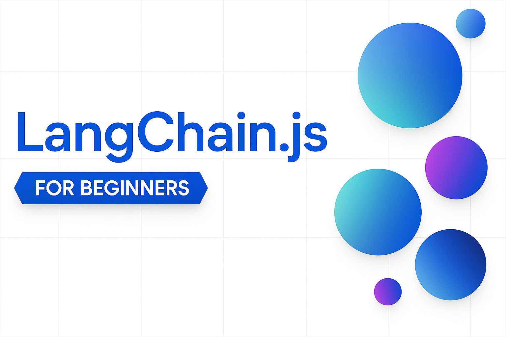

# LangChain.js for Beginners

## 🚀 Welcome!

Welcome to **LangChain.js for Beginners**, your hands-on guide to building AI-powered applications with LangChain.js and TypeScript.

Building an AI application is a lot like cooking a gourmet meal. You can gather every ingredient yourself, make each sauce from scratch, and craft your own tools. Or, you can work in a well-equipped kitchen stocked with quality ingredients and reliable recipes. **LangChain.js is that well-equipped kitchen for AI development.**

### What You'll Learn and Build

This course takes you from zero to building robust AI applications:

- **🤖 Conversational AI** - Build context-aware chatbots with streaming responses and customizable behavior
- **🔍 Semantic Search** - Create search systems that understand meaning, not just keywords
- **🛠️ Function Calling & Tools** - Give AI the ability to use tools and extract structured data
- **🚀 Autonomous Agents** - Build agents that reason, make decisions, and choose tools autonomously
- **🌐 MCP Integration** - Connect AI to external services using the Model Context Protocol standard
- **🎯 Agentic RAG** - Build intelligent Q&A systems where agents decide when to search your knowledge base

**By the end**, you'll have a solid understanding of LangChain.js and understand how to build real AI applications you can deploy!

> **🎯 Teaching Approach:** This course uses an agent-first progression. You'll learn about tools, then agents, then combine them with document retrieval to build agentic RAG systems. This mirrors how modern production AI systems are built.

> [!TIP]
> **New to AI development?** Check out our companion course [**Generative AI with JavaScript**](https://github.com/microsoft/generative-ai-with-javascript) to learn AI fundamentals first!

---

## 📚 Table of Contents

This course contains **9 chapters** (setup + 8 chapters), each building on the previous to teach you LangChain.js from the ground up. Each chapter includes conceptual explanations, working code examples, and hands-on challenges.

| # | Chapter | Description | Key Concepts |
|---|---------|-------------|--------------|
| 0 | [Course Setup](./00-course-setup/README.md) | Set up your development environment (local or cloud-based) | Node.js, GitHub Models/Azure AI, Codespaces, environment variables |
| 1 | [Introduction to LangChain.js](./01-introduction/README.md) | Understanding the framework and core concepts | LangChain fundamentals, first LLM call |
| 2 | [Chat Models & Basic Interactions](./02-chat-models/README.md) | Chat models, messages, and conversations | Message types, streaming, error handling, temperature |
| 3 | [Prompts, Messages, and Structured Outputs](./03-prompts-messages-outputs/README.md) | Working with prompts, message arrays, and type-safe outputs | Messages, templates, structured outputs, Zod schemas |
| 4 | [Function Calling & Tools](./04-function-calling-tools/README.md) | Extending AI capabilities with function calling and tools | Zod schemas, tool binding, type safety |
| 5 | [Getting Started with Agents](./05-agents/README.md) | Building autonomous agents that reason and choose tools | ReAct pattern, agent loops, createAgent(), middleware |
| 6 | [Model Context Protocol (MCP)](./06-mcp/README.md) | Connect AI to external services using the MCP standard | MCP servers, HTTP/stdio transports, tool integration, multi-server patterns |
| 7 | [Documents, Embeddings & Semantic Search](./07-documents-embeddings-semantic-search/README.md) | Loading documents, creating embeddings, and building semantic search | Document loading, chunking, vector embeddings, similarity search |
| 8 | [Building Agentic RAG Systems](./08-agentic-rag-systems/README.md) | Building RAG systems where agents intelligently decide when to search documents | Agentic RAG (agents decide when to search), retrieval tools, intelligent Q&A |

Each chapter includes:
- 📖 **Conceptual explanations** with real-world analogies
- 💻 **Code examples** you can run immediately
- 🎯 **Hands-on challenges** to test your understanding
- 🔑 **Key takeaways** to reinforce learning

We're planning to expand this course over time with additional topics as well. Stay tuned for updates!

---

## 📋 Prerequisites

Before starting this course, you should be comfortable with:

- **JavaScript/TypeScript fundamentals** - Variables, functions, objects, async/await
- **Node.js (LTS)** and npm - Package management and CLI tools
- **Basic Generative AI concepts** - Basic understanding of LLMs, prompts, tokens which are covered in our [GenAI with JavaScript](https://github.com/microsoft/generative-ai-with-javascript) course

### Required Tools

- [Node.js (LTS)](https://nodejs.org/)
- Code editor ([VS Code recommended](https://code.visualstudio.com/))
- Terminal/Command line
- [Git](https://git-scm.com/)

### AI Provider Account

You'll need access to an AI provider. We recommend:

- ✅ **GitHub Models** - Free for learning and experimentation
- ✅ **Azure AI Foundry** - For production deployments

---

## 📖 Course Resources and Additional Samples

- **[Glossary](./GLOSSARY.md)** - Comprehensive definitions of all terms used throughout the course
- **[LangChain.js Documentation](https://docs.langchain.com/oss/javascript/langchain/overview)** - Official LangChain.js docs for deeper dives
- **[AI Agent with MCP tools Sample](https://github.com/microsoft/ai-agents-for-beginners-sample)** - Learn how to build a complete burger ordering system with a serverless API, web interfaces, and an MCP server that enables AI agents to browse menus, place orders, and track order status.
- **[AI Travel Agents Sample](https://github.com/Azure-Samples/azure-ai-travel-agents)** - Learn how to orchestrate multiple AI agents to create a travel planning application using Azure AI services.

---

## Additional Resources 

### Azure / Edge / MCP / Agents

---
 
### Generative AI Series

[-9333EA?style=for-the-badge&labelColor=E5E7EB&color=9333EA)](https://github.com/microsoft/Generative-AI-for-beginners-dotnet?WT.mc_id=academic-105485-koreyst)
[-C084FC?style=for-the-badge&labelColor=E5E7EB&color=C084FC)](https://github.com/microsoft/generative-ai-for-beginners-java?WT.mc_id=academic-105485-koreyst)
[-E879F9?style=for-the-badge&labelColor=E5E7EB&color=E879F9)](https://github.com/microsoft/generative-ai-with-javascript?WT.mc_id=academic-105485-koreyst)

---
 
### Core Learning

---
 
### Copilot Series

---

## Getting Help

If you get stuck or have any questions about building AI apps, join:

If you have product feedback or errors while building visit:

---

## Contributing

This project welcomes contributions and suggestions.  Most contributions require you to agree to a Contributor License Agreement (CLA) declaring that you have the right to, and actually do, grant us the rights to use your contribution. For details, visit <https://cla.opensource.microsoft.com>.

When you submit a pull request, a CLA bot will automatically determine whether you need to provide a CLA and decorate the PR appropriately (e.g., status check, comment). Simply follow the instructions provided by the bot. You will only need to do this once across all repos using our CLA.

This project has adopted the [Microsoft Open Source Code of Conduct](https://opensource.microsoft.com/codeofconduct/). For more information see the [Code of Conduct FAQ](https://opensource.microsoft.com/codeofconduct/faq/) or contact [opencode@microsoft.com](mailto:opencode@microsoft.com) with any additional questions or comments.

## Trademarks

This project may contain trademarks or logos for projects, products, or services. Authorized use of Microsoft trademarks or logos is subject to and must follow [Microsoft's Trademark & Brand Guidelines](https://www.microsoft.com/legal/intellectualproperty/trademarks/usage/general). Use of Microsoft trademarks or logos in modified versions of this project must not cause confusion or imply Microsoft sponsorship. Any use of third-party trademarks or logos is subject to those third-parties' policies.

